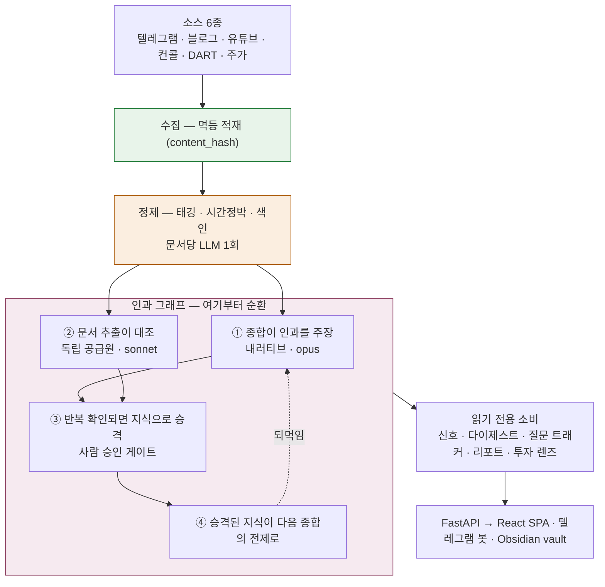
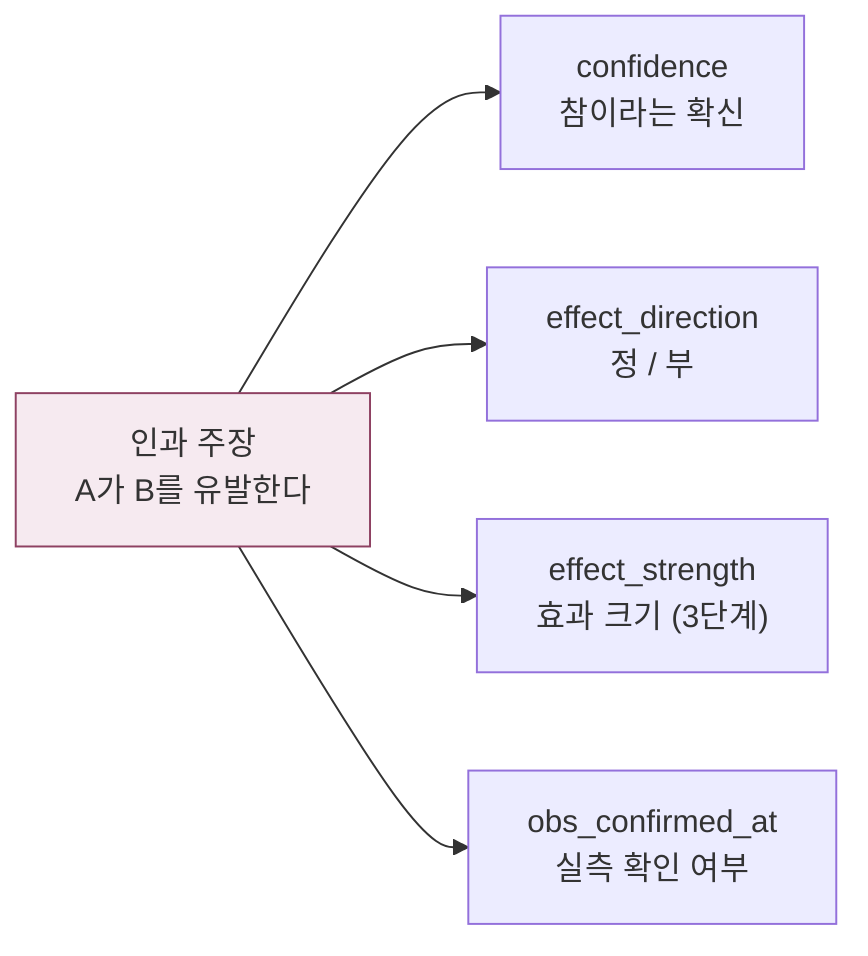

# Explorer

## 인과 지식그래프 기반 리서치 시스템

- 금융시장 데이터(미국 실적 컨콜·DART·주가), 투자자 인사이트(텔레그램·블로그·유튜브 등), 뉴스 등 수집
- LLM 기반으로 태깅 → 인과 지식그래프화
- 지식그래프 기반으로 다양한 Application 구현(내러티브 생성 에이전트, RAG 검색, 리서치 생성 에이전트 등)


---

## 설계 원칙


| 하지 않는 것     | 이유                                             |
| ----------- | ---------------------------------------------- |
| 자동매매        | 판단은 사람 몫입니다                                    |
| 가격 예측       | 거시적인 금융시장은 물리적 법칙이 아니므로, LLM 기반 예측을 확정하는 것은 지양 |
| 전종목 실시간     | 커버리지를 좁히는 대신 깊게 봅니다                            |
| 근거 없는 AI 답변 | 출처를 못 대면 답하지 않습니다                              |
| SaaS화       | 지금은 1인용입니다. 멀티유저는 별개의 문제입니다                    |


### 관통하는 원칙 네 가지

1. **분리해서 쌓습니다** — 사실과 가설, 주목과 확신, 확신과 효과 크기. 섞으면 정보가 죽습니다.
2. **정직이 정밀을 이깁니다** — 모르면 모른다고 하고, 근거 없으면 거부하고, 답은 범위로 냅니다.
3. **기계는 제안하고 사람이 판단합니다** — 자동화는 후보 생성까지입니다.
4. **시간을 1급으로 다룹니다** — 언제 작동하는 주장인지, 얼마나 느리게 변하는지, 어떻게 쌓였는지.

---

## 작동 방식

보통 "수집 → 정제 → 그래프화"까지를 ETL 한 덩어리로 묶고 그 위에 활용을 얹었다고 설명합니다.


이 시스템은 해당 방식과 다르게 설계했습니다. **단방향인 구간은 정제까지고, 그 위는 순환입니다.**



인과 엣지의 **3분의 2 가까이를 종합이 만듭니다.** 문서 추출은 주 공급원이 아니라 독립적인
대조군입니다. 두 경로가 같은 엣지를 주장할 때 그게 승격 근거가 됩니다.
"하나의 인과 그래프, 두 개의 속도"라는 원칙을 이렇게 구현했습니다. 빠른 서사와 느린 축적은
별개 시스템이 아니라 같은 그래프를 다른 속도로 본 것입니다.

### 사실과 가설을 섞지 않습니다

가장 되돌리기 어려운 결정이고, 나머지 결정들을 설명하는 축이기도 합니다.

LLM이 만든 건 전부 가설로 적재됩니다. confidence와 모델명을 달고 다니고, 화면에서 색이 다릅니다.
여기서 한 걸음 더 나가서 하나의 인과 주장을 **네 축으로 쪼갭니다.**



나눈 이유는 이렇습니다. *"강한 부정적 영향인데 사실인지는 반신반의"* 와
*"약한 긍정적 영향인데 확실함"* 은 전혀 다른 정보입니다. 하나의 숫자로 뭉개면 나중에
분해할 방법이 없습니다. 같은 이유로 지식을 평가할 때도 **주목(salience)과 확신(conviction)을
직교 축**으로 둡니다. 그 둘의 갭이야말로 찾으려는 것이기 때문입니다.

자세한 배경은 [docs/TECH_DECISIONS.md](docs/TECH_DECISIONS.md#from-epistemology)에 정리했습니다.

---

## 기술 스택


| 영역  | 선택                                                                           |
| --- | ---------------------------------------------------------------------------- |
| 백엔드 | FastAPI · SQLite (WAL) · Pydantic                                            |
| 프론트 | React 19 · TypeScript · Vite · Tailwind v4 · shadcn/ui · TanStack Query      |
| 시각화 | Recharts · lightweight-charts · React Flow + dagre                           |
| 검색  | SQLite FTS5(BM25) + sqlite-vec, RRF 융합                                       |
| 임베딩 | fastembed 로컬 (다국어 MiniLM 384d) — API 키 불필요                                   |
| LLM | Claude — haiku / sonnet / opus 용도별 티어                                        |
| 데이터 | OpenDartReader · FinanceDataReader · pykrx · yfinance · FRED · Alpha Vantage |
| 스케줄 | launchd (macOS user agent)                                                   |


**외부 인프라가 없습니다.** 검색 엔진도 벡터 DB도 큐도 컨테이너도 쓰지 않습니다.
SQLite 파일 하나와 파이썬 스크립트가 전부입니다. 무료 데이터에 구독 LLM, 로컬 실행이라
**월 운영비가 사실상 0원**인데, 이 제약이 아키텍처 결정 대부분을 설명합니다.

---

## 시작하기

Python 3.11+, Node 20+, [Claude Code CLI](https://claude.com/claude-code)(구독 인증) 또는
`ANTHROPIC_API_KEY`, 그리고 DART API 키(무료)가 필요합니다.

```bash
git clone https://github.com/Vacayy/explorer.git && cd explorer

python -m venv .venv && source .venv/bin/activate
pip install -r backend/requirements.txt
cd frontend && npm install && cd ..

cp .env.example .env      # DART_API_KEY, CLAUDE_BIN 최소 입력
```

DB는 저장소에 없습니다(`.gitignore`). 빈 상태에서 만들어 채웁니다.

```bash
python scripts/seed_companies.py    # DART 전종목
python scripts/seed_sectors.py      # 업종(KSIC)·시장 구분
python scripts/seed_entities.py     # 그래프 엔티티
python scripts/seed_universe.py     # 커버리지 (예시 시드)
python scripts/ingest_prices.py     # 주가 — 첫 실행은 오래 걸립니다
```

수집할 소스는 앱을 띄운 뒤 **피드 → 사이드바**에서 등록합니다.

```bash
cd backend && ../.venv/bin/uvicorn main:app --reload --port 8000   # :8000
cd frontend && npm run dev                                          # :5174
```

자동화까지 걸려면 (macOS):

```bash
python scripts/install_launchd.py    # --dry-run 으로 먼저 확인
launchctl list | grep dev.explorer
```

30분 수집 체인과 아침 브리핑, 백업을 포함한 잡들이 등록됩니다.
cron이 아니라 launchd를 쓴 데는 이유가 있는데,
[제약에서 나온 결정](docs/TECH_DECISIONS.md#from-local-constraints)에 적었습니다.

> `seed_universe.py`에는 예시 종목만 들어 있습니다. 본인 커버리지를 쓰려면
> `scripts/universe.local.json`(gitignore)에 두면 그쪽을 먼저 읽습니다.

---

## 프로젝트 구조

```
backend/
  pipeline/      70개 모듈 — 수집·정제·그래프·종합. 시스템의 무게는 여기 있습니다
    connectors/  소스별 커넥터 (discover → fetch 프로토콜)
  routers/       54개 — spine_*(그래프 세계) 36 + 레거시(종목 디테일) 18
  database.py    85개 테이블
frontend/src/
  components/    ui(shadcn) → shared → layout → {page} 계층
scripts/         52개 — 수집 체인·배치·시딩·백필
docs/            아래 참조
```

## 문서

문서는 변경 빈도로 층을 나눴습니다. 규칙은 거의 안 변하고, 상태는 커밋마다 변하고,
결정은 쌓이기만 합니다.


| 문서                                          | 층     | 내용                                           |
| ------------------------------------------- | ----- | -------------------------------------------- |
| [PHILOSOPHY.md](docs/PHILOSOPHY.md)         | 원칙    | 개별 결정 뒤에 흐르는 세계관. 인식론·인과 세계모델·시장 인식론·R&R |
| [TECH_DECISIONS.md](docs/TECH_DECISIONS.md) | 원칙→결정 | **기획 의도와 주요 기술 결정.** 성능·비용을 어떻게 저울질했는지       |
| [SYSTEM.md](docs/SYSTEM.md)                 | 상태    | 현행 시스템 지도 — 테이블·파이프라인·API·화면 전체 목록           |
| [DECISIONS.md](docs/DECISIONS.md)           | 결정    | append-only 로그 133건. 고려했지만 선택하지 않은 것까지       |
| [DESIGN_SYSTEM.md](docs/DESIGN_SYSTEM.md)   | 상태    | 레이아웃 컨트랙트·토큰                                 |
| `docs/specs/`                               | 상태    | 기능별 화면·구현 스펙                                 |


`DECISIONS.md`는 고치지 않습니다. 결정을 뒤집을 때는 새 항목을 쓰고 원래 항목에 한 줄을 답니다.
결정이 바뀌었다는 사실 자체가 기록이기 때문입니다.

---

## 데이터와 백업

이 저장소는 **로직만** 담습니다. 축적물은 전부 `.gitignore`이고 따로 관리합니다.
값어치는 거기 있는데 재생성이 안 되기 때문입니다.


| 대상                             | 크기    | 어디에                     | 재생성                                                           |
| ------------------------------ | ----- | ----------------------- | ------------------------------------------------------------- |
| `backend/db/stock_explorer.db` | 422MB | 백업만 (`BACKUP_DIR`)      | **불가** — 텔레그램은 공개 채널 최근 ~20개 창만 긁습니다. 그동안 모은 과거 문서는 다시 못 모읍니다 |
| `vault/` (사람이 쓴 노트)            | 2MB   | **별도 private 저장소** + 백업 | **불가** — 원본입니다                                                |
| `vault/entities/`              | 32MB  | 어디에도 안 올림               | 가능 — `vault_sync --export`가 DB에서 다시 만듭니다                      |
| `media/` (텔레그램 첨부)             | 215MB | 백업만                     | 부분 — CDN 만료분은 영구 소실입니다                                        |
| `logs/`                        | —     | 안 함                     | 상관없습니다                                                        |


### vault는 별도 저장소입니다

`vault/`는 이 저장소에서 제외돼 있고 **자체 git 저장소**로 따로 버전 관리합니다.
디렉터리 안에 `.git`이 따로 있는, 서브모듈이 아닌 독립 저장소입니다.
실명 기업 분석과 개인 투자 방법론이 들어 있어서 이 저장소와 공개 범위가 달라야 하기 때문입니다.

새 기기에서 복구하려면 그 저장소를 `vault/`에 따로 clone 해야 합니다. 안 해도 앱은 뜨지만
canon 지식층과 투자 렌즈의 원칙 원장이 빕니다.

### 백업

```bash
python scripts/backup.py            # .env BACKUP_DIR 로
python scripts/backup.py --verify-only <파일.sqlite.gz>
```

- DB는 `VACUUM INTO`로 뜹니다. 실행 중에도 안전하고 조각까지 제거합니다(422MB → gzip 123MB).
파일을 그냥 복사하면 쓰기 중일 때 깨진 스냅샷이 나옵니다.
- **만든 뒤에 열어서 검증합니다** — `PRAGMA integrity_check`와 핵심 테이블 건수를 확인합니다.
복원해본 적 없는 백업은 백업이 아닙니다.
- 7세대를 보관합니다. 랩탑 고장뿐 아니라 "잘못된 배치가 데이터를 망친" 논리 사고까지
되돌리기 위해서입니다.
- launchd `dev.explorer.backup`이 매일 04:30에 돕니다(실측 20초).

**현재 `BACKUP_DIR`는 로컬 디스크입니다.** 논리 사고는 막지만 **랩탑 고장에는 무의미합니다.**
외장이나 클라우드 동기화 폴더로 옮기는 게 남은 숙제입니다. 옮길 때는 `.env`의 `BACKUP_DIR`만
바꾸고 기존 폴더를 통째로 복사하면 됩니다. 백업 레이아웃이 자기완결적이라 그것만으로 끝납니다.

---

## 한계

- **가용성** — 랩탑에 묶여 있습니다. 맥이 꺼지면 수집이 멈춥니다.
- **단일 라이터** — SQLite로 버티지만 쓰기는 하나뿐이라, 체인 겹침을 파일 락으로 막고 있습니다.
- **텔레그램** — 공개 채널의 최근 ~20개 창만 봅니다. 로그인 없는 프리뷰 스크랩이라 그렇습니다.
- **컨콜** — 무료 API 하루 25건입니다. 이 한도가 검증 층의 데이터 상한을 그대로 결정합니다.
- **닫히지 않은 고리** — 실관측이 인과를 확증하는 마지막 경로가 배선만 되고 아직 발화한 적이 없습니다.
원인은 [TECH_DECISIONS.md](docs/TECH_DECISIONS.md#open-problems)에 적었습니다.
- **한국어 전용** — UI도 프롬프트도 문서도 전부 한국어입니다.

## 라이선스

[MIT](LICENSE). 수집한 콘텐츠의 저작권은 각 원저작자에게 있습니다.
개인의 열람과 리서치를 전제로 만들었고, 수집물의 재배포는 고려하지 않았습니다.