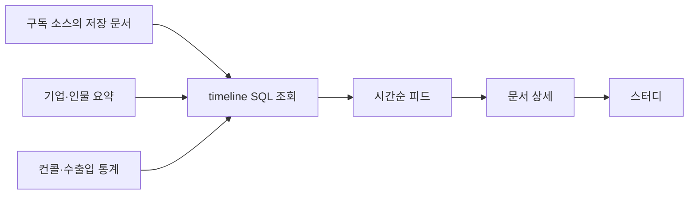
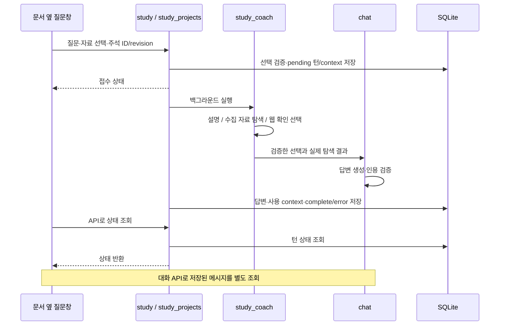

# 구현 구조와 기술 선택

이 문서는 Explorer의 주요 기능이 **어떤 경로로 실행되고, 어디에 저장되며, 왜 그렇게 구현됐는지** 설명합니다.
전체 API·운영 목록은 [SYSTEM.md](SYSTEM.md), 원칙은 [PHILOSOPHY.md](PHILOSOPHY.md), 당시 결정과 측정 기록은 [DECISIONS.md](DECISIONS.md)에 있습니다.

2026-09-12 코드 대조 기준입니다. 아래의 구현 설명과 향후 과제는 구분해서 읽어주세요. 과거 운영 수량이나 응답 시간을 현재 성능으로 사용하지 않습니다.

- [제품과 구현 범위](#starting-point)
- [주요 기능의 실행 흐름](#implementation)
- [사실·해석·시간을 기록하는 방법](#from-epistemology)
- [LLM 호출과 비용](#from-cost)
- [저장소·검색·운영](#from-local-constraints)
- [조회 성능과 화면 상태](#from-performance)
- [남아 있는 과제](#open-problems)
- [검증과 문서 유지](#appendix)

<a id="starting-point"></a>
## 제품과 구현 범위

관심 있는 투자자와 기업의 자료를 모아 읽고, 기대가 어떻게 달라지는지 살피며, 사용자의 질문과 생각을 함께 보존하는 개인 리서치 도구입니다.
자료 수집·정리·검색은 자동화하고 최종 투자 판단은 사용자에게 남깁니다.

현재 구현은 크게 세 부분입니다.

| 부분 | 하는 일 | 경계 |
|---|---|---|
| 시장·피드 | 시장 지표, 브리핑, 구독 소스와 시스템 요약 조회 | 읽기 시 저장 결과를 활용하며 모든 지표가 실시간인 것은 아님 |
| 스터디·대화 | 문서 보존, 주석, 자료 묶음, 관련 자료 탐색과 설명 | 사용자 선택과 실제 사용한 근거를 기록 |
| 그래프·기대 관측 | 인과 주장과 근거 연결, 메모리반도체 자료 검토 | 기대·가격·수급을 자동으로 연결하는 전체 설계는 미완성 |

로컬 실행과 단일 사용자에 맞춰 운영을 단순하게 유지합니다. LLM 구독료·API 사용량, 실행 지연과 관리 비용은 별도로 발생합니다.

<a id="implementation"></a>
## 주요 기능의 실행 흐름

### 1. 수집한 자료가 피드에 나오기까지

[ingest.py](../scripts/ingest.py)가 등록된 커넥터를 [runner.py](../backend/pipeline/runner.py)로 실행합니다.
소스별 수집 결과는 `raw_documents`에 저장되고, [enrich.py](../backend/pipeline/enrich.py)가 태그·요약·시간 정보를 `enrichments`에 기록합니다.
검색 색인은 [search.py](../backend/pipeline/search.py)가 담당합니다. 수집과 정리 결과를 보존하므로 화면을 열 때 같은 자료를 다시 가져올 필요가 없습니다.

홈 피드는 별도 게시물 원장을 만들지 않고 기존 데이터에서 읽기용 목록을 구성합니다.



[spine_feed.py](../backend/routers/spine_feed.py)의 `/api/spine/feed/timeline`과 `/channels`는 [timeline.py](../backend/pipeline/timeline.py)를 사용합니다.
게시·수집·요약 생성 시각을 구분하고, 시간과 안정 ID로 정렬합니다. 조회 상한 시각 `until`을 유지해 페이지를 넘기는 동안 새 게시물 때문에 순서가 밀리는 일을 줄입니다.
이 조회 자체는 LLM 호출이나 수집을 수행하지 않습니다. 다만 원본 요약 캐시가 수정되면 과거 화면까지 불변으로 유지되는 구조는 아닙니다.

화면은 [HomePage](../frontend/src/components/home/HomePage.tsx)의 시장/피드 모드와 [ChannelReader](../frontend/src/components/feed/ChannelReader.tsx)로 구성합니다.
카드·필터·시각의 상세 계약은 [홈·피드 스펙](specs/home-feed.md)에 있습니다.

### 2. 유튜브 자막과 AI 정리본

[spine_doc.py](../backend/routers/spine_doc.py)의 문서 GET은 저장된 자막·정리본·생성 상태를 반환합니다.
화면은 AI 정리본이 없을 때 별도 POST로 생성을 요청하고 완료 상태를 조회합니다.

[youtube_digest.py](../backend/pipeline/youtube_digest.py)는 `youtube_digest_jobs`에 자막을 보존하고 작업 토큰과 상태를 기록합니다.
큐 등록은 `BEGIN IMMEDIATE`로 경쟁을 줄이고, 진행 중인 동일 문서 요청을 재사용합니다. 실패 후에는 명시적으로 재시도합니다.
이렇게 조회와 생성을 분리해 문서 열람이 긴 LLM 작업을 기다리지 않게 했습니다(D-157).

짧은 검색용 요약, 영상 AI 정리본, 원본 자막은 용도가 다릅니다. 이미 소실된 과거 자막까지 복원하는 기능은 아닙니다.
화면 구현은 [DocumentBody](../frontend/src/components/doc/DocumentBody.tsx)를 참고하세요.

### 3. 스터디 본문과 주석

[study.py](../backend/pipeline/study.py)의 `open_document`는 처음 열었을 때의 본문·제목·URL·hash를 `study_sessions`에 고정합니다.
수집 원문이 나중에 바뀌어도 기존 하이라이트의 위치는 바뀌지 않습니다. 유튜브의 저장 본문이 AI 정리본인 경우에는 그 종류를 표시합니다.

[StudyPage](../frontend/src/components/study/StudyPage.tsx)는 DOM 선택 범위를 Unicode code point 위치로 변환합니다.
서버는 고정 본문의 `body[start:end]`와 선택 문자열 `exact`가 같은지 검사한 뒤 `study_annotations`에 저장합니다.
코멘트 수정은 `revision`으로 충돌을 검사하고 삭제는 `deleted_at`으로 표시합니다. 과거 답변에 사용한 주석 내용은 당시 대화 context에 남습니다.

현재 본문은 문자 위치를 유지하기 위해 보관 텍스트로 렌더합니다. Markdown을 별도 DOM으로 변환하거나 이미지·PDF의 영역을 표시하는 기능은 포함하지 않습니다.

### 4. 여러 자료를 묶는 프로젝트와 통합 노트

[study_projects.py](../backend/pipeline/study_projects.py)가 프로젝트와 자료 소속을 관리합니다.

| 저장 위치 | 역할 |
|---|---|
| `study_projects` | 이름, 자유 메모, revision, 프로젝트 대화 연결 |
| `study_project_members` | 포함 자료와 제거 여부 |
| `study_sessions` | 문서·프로젝트별 고정 본문; `project_id=0`은 단일 스터디 |
| `study_annotations` | 인용 위치, 하이라이트, 코멘트 |
| `study_turns` / `study_project_turns` | 요청 키, 질문, 당시 context, 처리 상태 |

같은 자료라도 프로젝트가 다르면 주석을 별도로 관리합니다. 프로젝트에서 자료를 빼도 본문과 주석을 삭제하지 않아 다시 추가하면 이어서 읽을 수 있습니다.
북마크인 `saved_items`와는 독립이며, 본문 붙여넣기로 만든 자료도 북마크나 수집 원문을 만들지 않습니다.

[ProjectPage](../frontend/src/components/study/ProjectPage.tsx)는 단일 스터디의 읽기·주석 컴포넌트를 재사용합니다.
현재는 문서 탭과 두 자료 비교가 남아 있고, 오른쪽은 **노트 / AI 대화**입니다. 노트에는 전체 포함 자료의 인용 카드와 자유 메모를 모으며 출처 태그로 원문 위치에 이동합니다.
여러 자료를 하나의 세로 스크롤로 이어 읽는 변경은 아직 적용 전입니다. 통합 노트는 화면 통합이며 저장 테이블을 합친 것은 아닙니다(D-158·D-160).

### 5. 선택한 문장과 코멘트로 AI에 질문하기

단일·프로젝트 `/ask`는 주석 ID와 revision을 받습니다. 서버가 소속과 변경 여부를 확인하고 인용문·앞뒤 문맥·저장 코멘트를 다시 구성합니다.
클라이언트가 보낸 임의 본문을 그대로 근거로 채택하지 않습니다.



주석을 선택하지 않은 자료는 본문 앞 16,000자까지, 선택한 주석은 앞뒤 400자 문맥과 함께 사용합니다.
프로젝트 요청은 최대 10자료·40근거·합계 80,000자로 제한하고 초과하면 선택을 줄이도록 응답합니다.
요청 키로 중복 접수를 막고, 중단된 pending 작업은 일정 시간 뒤 명시적으로 정리합니다. 외부 작업 큐가 아닌 FastAPI 백그라운드 작업이므로 프로세스 재시작 시 자동 재개를 보장하지 않습니다.

[study_coach.py](../backend/pipeline/study_coach.py)는 `auto / off / library / web` 설정에 따라 설명 또는 탐색을 준비합니다.
관련 자료 요청은 기존 문서를 제외한 수집 자료 검색으로 연결합니다. 웹 확인은 Claude Code의 WebSearch/WebFetch 결과만 근거로 채택하며, 검색 발췌와 실제 원문 확인을 구분합니다. API 엔진에서는 이 웹 도구 경로를 지원하지 않습니다.

후속 질문에서는 완료된 턴의 `context_ref`를 사용하고 동일 주석 전문을 다시 첨부하지 않습니다. 새 선택은 별도 snapshot입니다.
이전 대화와 짧은 학습 초점은 남으므로 “맥락을 전혀 보내지 않는다”는 의미는 아닙니다(D-159).
자유 메모는 AI에 자동으로 주입되지 않으며, 주석의 저장 코멘트가 선택 context에 포함됩니다.

### 6. 일반 대화와 공통 처리

[chat.py](../backend/pipeline/chat.py)의 일반 경로는 `route → gather → review → synthesize → verify`입니다.
질문에 맞는 자료를 모으고 부족하면 제한된 추가 탐색 후 답변을 만듭니다. 스터디는 일반 라우터를 우회하고 위의 학습 context와 탐색을 준비한 뒤 같은 합성·인용 검증을 사용합니다.
인용 검증은 답변의 근거 참조를 점검하는 단계이며 모든 문장의 진실성을 보장하지는 않습니다.

대화는 `conversations`·`chat_messages`에 남습니다. [chat_memory.py](../backend/pipeline/chat_memory.py)가 최근 대화와 상태를 불러옵니다.
일반 대화의 `attached_doc_ids`는 사용자가 읽던 자료 선택을 유지하고, 답변 드래그 인용은 선택 문장·문단·근거와 길이 제한이 있는 이전 답변을 함께 전달합니다(D-145·D-146·D-150).

### 7. 인과 그래프와 기대 변화 실험

[doc_causal.py](../backend/pipeline/doc_causal.py)는 문서에서, [narrative.py](../backend/pipeline/narrative.py)는 종합 과정에서 인과 주장을 만듭니다.
[consolidation.py](../backend/pipeline/consolidation.py)의 승격 배치는 근거를 대조하고 `knowledge`의 후보를 만듭니다. 후보 생성·근거 병합과 최종 채택은 다른 동작입니다.
[narrative_graph.py](../backend/pipeline/narrative_graph.py)는 연결을 순회해 화면에서 살펴볼 그래프를 구성합니다.
문서가 같은 주장을 반복한다고 실제 인과관계가 입증되는 것은 아니므로 독립성·반박·관측을 따로 다룹니다.

기대 변화 관측은 [experiment_expectations.py](../backend/routers/experiment_expectations.py)의 별도 라우터로 추가했습니다.
[expectation_store.py](../backend/pipeline/expectation_store.py)는 검토 결과를 운영 DB 옆 `expectations_experiment.sqlite`에 저장합니다.
기존 데이터는 읽기 참조하고 원장 검토가 운영 그래프를 교체하지 않습니다. 메모리 자료를 읽고 첨부해 대화하는 경로와 발언 검토 원장은 구현돼 있습니다.
가격·펀더멘털·심리·수급의 자동 결합은 [공통 설계](specs/expectation-observatory-greenfield.md)에 있는 후속 범위입니다.

<a id="from-epistemology"></a>
## 사실·해석·시간을 기록하는 방법

<a id="epistemic-type"></a>
`entity_relations.epistemic_type`은 사실·관측 해석·가설을 구분합니다. LLM이 만든 인과 주장은 가설로 다루는 것이 원칙입니다.
다만 **모든 산출물에 같은 컬럼이 있거나 출처가 DB 제약으로 필수인 것은 아닙니다.** 실제 스키마에서 `source_doc_id`와 `confidence`는 nullable이며, 스터디·요약은 각자의 본문 종류·모델·context 필드로 출처와 생성 경로를 기록합니다.

<a id="four-axes"></a>
인과 주장에는 `confidence`, `effect_direction`, `effect_strength`, `obs_confirmed_at`을 구분합니다.
“영향이 크다”와 “그 주장이 믿을 만하다”는 다른 정보입니다. 경로 신뢰도는 예상 수익률이나 인과 효과의 크기가 아닙니다.
강도는 `unknown / weak / moderate / strong`처럼 범주로 표현해 근거 없는 소수점 정밀도를 피합니다(D-065·D-066).

<a id="salience-conviction"></a>
지식의 `salience`와 `conviction`도 구분합니다. 언급이 많다는 것은 수집한 자료 안에서의 주목도이며, 투자자 전체의 합의나 사실 여부를 뜻하지 않습니다.
유명한 사람의 단발 발언도 검토할 자료이며 그 자체가 강한 증명은 아닙니다.

<a id="time-anchoring"></a>
태깅은 `time_orientation`과 `reference_period`를 함께 추출합니다. 별도 호출을 줄이지만 출력 토큰까지 무료라는 뜻은 아닙니다.
발행일과 전망 대상 기간을 구분하고, 추출 오류나 기간 미상은 이후 검토에서 확인해야 합니다.

<a id="facts-vs-lenses"></a>
역사적 사건과 해석 프레임도 분리합니다. [lenses.py](../backend/pipeline/lenses.py)는 관점과 질문을 제공하는 역할이며, 렌즈를 적용했다는 이유로 그 설명이 확증된 지식이 되지는 않습니다.

<a id="from-cost"></a>
## LLM 호출과 비용

<a id="subscription-auth"></a>
[enrich.llm_engine](../backend/pipeline/enrich.py)은 `ENRICH_ENGINE=claude-code`이고 CLI 경로가 있으면 CLI를 우선합니다. 그 조건이 아니고 `ANTHROPIC_API_KEY`가 있으면 API를 사용합니다.
따라서 API 키를 추가했다고 항상 API로 전환되지는 않습니다.
[llm.py](../backend/pipeline/llm.py)는 공통 호출·스트리밍·사용량 기록을 제공하지만, 기존 모듈의 별도 CLI 호출도 남아 있습니다.

기본 CLI 호출은 프로젝트·사용자 설정을 로드하지 않고 도구를 끕니다. 스터디 웹 탐색에만 WebSearch/WebFetch를 명시적으로 열고 턴 수를 제한합니다.
수집 문서나 코멘트 안의 지시를 실행 권한으로 취급하지 않습니다.

<a id="model-tiers"></a>
| 용도 | 현재 코드의 기본값 | 확인 위치 |
|---|---|---|
| 단일 문서 태깅 | haiku | `enrich.py` |
| 태깅 배치 백필 | sonnet | `enrich.py`의 `BATCH_MODEL` |
| 대화 라우팅·추가 탐색 판단 | haiku | `chat.py`의 `CHAT_ROUTER_MODEL` |
| 대화·스터디 답변 합성 | sonnet | `chat.py`의 `RAG_MODEL` |
| 스터디 탐색 계획·웹 읽기 | haiku | `study_coach.py` |
| 내러티브·지식 종합 | opus | `narrative.py`·`consolidation.py` |

모델명은 기본값이며 환경 설정이나 개별 경로에 따라 다릅니다. “빈번한 작업은 무조건 haiku” 같은 전역 규칙으로 해석하지 않습니다.

<a id="hash-gates"></a>
재생성 가능한 요약·종합에는 문서 집합·입력·프롬프트 서명 등을 이용한 캐시 가드를 둡니다. 사용자 질문처럼 매번 의미가 다른 요청은 같은 정책을 적용하지 않습니다.
입력·모델·프롬프트 변경 시 어떤 캐시를 다시 만들지는 각 생성 모듈의 계약입니다.

<a id="measured-changes"></a>
과거 비용 점검으로 내러티브 배치 빈도(D-122), 닫힌 구간 다이제스트(D-124), 영상 선택 생성(D-115·D-157), effort 설정(D-117), 연속 실패 차단(D-119)을 조정했습니다.
당시 수치와 조건은 결정 이력에 보존합니다. 현재 품질·지연·사용량 평가는 실제 작업 로그로 다시 확인해야 합니다.

<a id="code-judges-llm-narrates"></a>
명확한 수치 규칙·중복 판정·예산 제한·정렬은 코드로 처리합니다. 의미 추출·비교·설명에는 LLM을 사용합니다.
LLM도 분류와 판단을 수행하므로 “서술만 LLM이 한다”는 설명은 맞지 않습니다. 의미 판단은 근거와 함께 검토 가능한 결과로 남깁니다.

<a id="approval-gate"></a>
승인 경계는 동작별로 다릅니다. 수집·태깅·예약 요약은 설정된 자동화로, 스터디 저장·질문은 사용자 요청으로 실행합니다.
어휘 병합·리포트 제안 등 승인 큐를 사용하는 경로는 해당 계약에 따라 채택 후 실행합니다. 시스템 전체가 승인 전 무행동인 것은 아닙니다.

<a id="from-local-constraints"></a>
## 저장소·검색·운영

<a id="single-sqlite"></a>
운영 데이터는 SQLite에 둡니다. [database.py](../backend/database.py)는 WAL, 외래키 검사, 30초 busy timeout을 설정합니다.
별도 DB 서버를 운영하지 않아도 되지만 동시 쓰기와 장시간 트랜잭션의 제약은 남습니다. 실험 원장은 별도 SQLite 파일이므로 저장소 전체가 파일 하나인 것도 아닙니다.

백업은 실행 중 DB 파일을 단순 복사하지 않습니다. [backup.py](../scripts/backup.py)가 `VACUUM INTO`로 snapshot을 만들고 압축·무결성 검사를 수행하며 vault·media도 보관합니다.
스터디 주석·대화·자유 메모는 운영 DB의 사용자 원본입니다. 기대 실험 DB는 별도 파일이므로 운영 DB 백업만으로 보존됐다고 간주하면 안 됩니다.

<a id="hybrid-search"></a>
검색은 FTS5와 sqlite-vec의 후보를 RRF 순위로 합칩니다. 각 검색 방식의 상위 후보를 보장하는 쿼터도 있어 순수 RRF만 적용한 구현은 아닙니다.
fastembed로 질의를 로컬 임베딩하며, 벡터 확장을 사용할 수 없는 경로는 키워드 검색만 남을 수 있습니다. 첫 임베딩 초기화 비용과 한국어·별칭 검색 품질은 별도 확인 대상입니다.

<a id="launchd-not-cron"></a>
수집·브리핑 배치는 [install_launchd.py](../scripts/install_launchd.py)로 macOS user agent에 등록합니다.
로컬 인증과 스케줄 실행 문제를 겪고 선택한 방식입니다(D-106). 기기 전원이 꺼져 있으면 실행되지 않으며, 누락 회차가 모두 개별 재생되는 것을 보장하지 않습니다.

<a id="process-lock"></a>
[run_chain.sh](../scripts/run_chain.sh)는 디렉터리 락과 PID 확인으로 체인 중복 실행을 줄입니다.
이는 API의 모든 쓰기를 직렬화하는 전역 락이 아닙니다. DB 트랜잭션, 생성 작업별 pending 상태, 수집 체인 락은 서로 다른 충돌을 다룹니다.

<a id="from-performance"></a>
## 조회 성능과 화면 상태

<a id="no-fetch-on-read"></a>
홈 피드와 문서 상세는 저장된 결과를 읽습니다. 지수 GET은 TTL이 만료되면 갱신을 `BackgroundTasks`로 예약하고 저장분을 반환합니다.
이 원칙을 전체 레거시 API가 이미 만족한다고 단정하지 않습니다. [spine_indices.py](../backend/routers/spine_indices.py)의 수동 snapshot POST처럼 외부 수집을 기다리는 경로도 있습니다.

<a id="semantic-invalidation"></a>
지수 API의 갱신 TTL은 하나라도 정규장이 열려 있으면 10분, 모두 닫혔으면 60분입니다. 화면의 조회 간격과 외부 데이터 갱신 TTL은 구분해야 합니다.

<a id="state-from-data"></a>
화면은 수집 시각·관측일과 생성 작업의 상태를 함께 사용합니다. 값이 오래됐다는 표시와 생성 중이라는 표시는 서로 다른 정보입니다.
실패한 자료가 있어도 나머지를 읽을 수 있도록 모듈별 상태를 나눕니다.

[PageLayout](../frontend/src/components/shared/PageLayout.tsx)은 헤더·본문 등 슬롯을 제공하고, [DetailLayout](../frontend/src/components/shared/DetailLayout.tsx)은 상세 읽기 화면의 공통 배치를 담당합니다.
타이포그래피와 색상·간격은 [디자인 시스템](DESIGN_SYSTEM.md)에 정의합니다. IBM 계열 본문 14px을 기준으로 하며 데이터 밀도와 모바일 가독성을 함께 조정합니다.
URL은 자료 ID·필터·복귀 경로에, React 상태와 브라우저 저장소는 팔레트·패널·초안·스크롤 같은 UI 상태에 사용합니다. 모든 탭이 URL 상태인 것은 아닙니다.

<a id="deferred"></a>
<a id="two-worlds"></a>
국내 기업 재무·주가 테이블과 문서·그래프 테이블은 함께 유지합니다. 기대 관측 실험도 기존 시스템을 교체하지 않는 별도 라우터로 추가했습니다.
<a id="no-deploy"></a>
다중 사용자·상시 가용성·다중 워커가 필요해지면 DB뿐 아니라 인증, 작업 큐, 파일 저장소, 복구 방식도 함께 재검토해야 합니다.

<a id="open-problems"></a>
## 남아 있는 과제

<a id="unclosed-loop"></a>
- **인과 검증**: 문서 간 일치와 실제 관측의 확인은 다릅니다. 코드 경로가 존재한다는 것과 운영에서 유효한 검증 사례가 쌓였다는 것도 구분해야 합니다. 과거의 “확인 0건” 수치를 이번 점검에서 다시 측정하지 않았으므로 현재 상태로 반복하지 않습니다.

<a id="other-open"></a>

- **기대 변화**: 발언·기간·대상을 비교하는 실험은 있지만, 기대와 시장 가격·파생상품 수급을 자동으로 연결하는 전체 흐름은 미구현입니다.
- **스터디**: 연속 세로 읽기, 자료 순서 관리, 미수집 URL 자동 가져오기, 이미지/PDF 주석이 남아 있습니다.
- **작업 복구**: 프로세스가 종료되면 진행 중 생성이 중단될 수 있습니다. 상태 표시·중단 정리와 자동 재실행은 다른 기능입니다.
- **자료 규모**: 현재 프로젝트 통합 노트는 포함 문서의 StudyWorkspace를 마운트해 주석을 모읍니다. 대형 프로젝트에는 본문 조회·렌더 비용을 줄이는 분리가 필요할 수 있습니다.
- **품질 평가**: 인용 검증과 단위 테스트만으로 설명의 유용성·검색 누락·인과 해석 품질을 확인할 수는 없습니다. 실제 읽기 사례의 별도 평가가 필요합니다.

<a id="appendix"></a>
## 검증과 문서 유지

| 확인할 계약 | 테스트·문서 |
|---|---|
| 스터디 선택 범위·revision·대화 저장 | `backend/tests/test_study.py` |
| 프로젝트 격리·자료 제거·이관 | `backend/tests/test_study_projects.py` |
| 후속 context·관련 자료·웹 근거 | `backend/tests/test_study_coach.py` |
| 유튜브 자막·생성 상태 | `backend/tests/test_youtube_digest.py` |
| 피드·시장 입력 | `backend/tests/test_timeline.py`, `test_home_market_order.py`, `test_macro_inputs.py` |
| 기대 관측 실험 | `backend/tests/test_expectation_*.py` |
| UI 행동과 미구현 범위 | [기능별 스펙](specs/README.md) |

저장소 루트에서 백엔드 계약 테스트와 프론트엔드 타입 검사·빌드를 실행합니다. 실제 LLM·외부 수집을 사용한 평가는 이 검사와 구분합니다.

```bash
PYTHONPATH=backend .venv/bin/python -m unittest discover -s backend/tests
npm --prefix frontend run build
```

구현이 바뀌면 담당 스펙과 SYSTEM을 갱신하고, 중요한 선택의 변경은 DECISIONS에 추가합니다.
이 문서는 주요 실행 경로와 선택 이유를 연결하는 역할을 유지합니다. 과거 결정은 덮어쓰지 않으며 개인 원문·실험 출력은 `logs/`에 둡니다.
