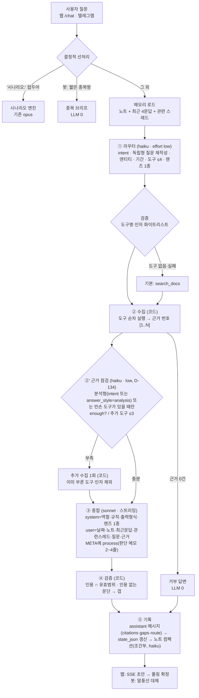
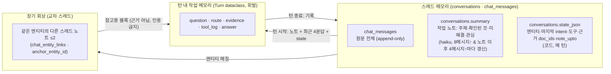

# 대화 에이전트 아키텍처 — 라우터·도구·멀티턴 메모리 (B 단계, 2026-09-08)

> 상태: **구현됨 (D-131)**. 분석·레퍼런스·단계 계획은 docs/specs/chat-harness.md, A 단계(러너·스트리밍·원장)는 D-130.
> 원칙 정박: PHILOSOPHY.md §1(사실/가설 분리·정직) · §4(기계는 제안, 사람이 판단) · D-004 ③(답변은 인덱스 밖).
> 레퍼런스: Anthropic *Building effective agents*(라우팅 워크플로우·ACI) · *Effective context engineering*(최소 고신호 토큰·just-in-time·컴팩션·구조화 노트) · *Agent SDK*(수집→행동→검증 루프·규칙 검증) · Cognition(단일 스레드·컨텍스트 공유) · Google ADK(Session/State/Memory 3층) · 논문 2601.07711(라우팅·재작성은 모델, 리랭킹은 결정적).

---

## 0. 한 문장

**"모델은 어떤 도구를 어떤 질문으로 부를지와 종합만 결정하고, 도구 실행·근거 번호·인용 검증·기억 갱신은 코드가 결정적으로 한다."** 단일 스레드, 턴당 LLM 2콜(라우터 haiku + 종합 sonnet), 도구는 전부 읽기 전용.

## 1. 턴 흐름



- **①만 판단, ②④⑤는 결정적.** 라우팅·재작성은 모델이 낫고 리랭킹·검증은 코드가 낫다는 실험 결과(2601.07711)를 그대로 따른다.
- **근거는 한 번호 체계.** 문서·내러티브·인과 엣지·시세·질문·렌즈가 전부 `[n]`으로 번호를 받는다. 인용 링크는 근거 종류별 내부 경로(`href`)로 간다(문서 `/doc/:id`, 내러티브 `/narrative?topic=`, 온톨로지 `/knowledge/ontology?focus=` …).
- **에이전틱 루프는 상한 1회.** 열린 재검색 루프는 두지 않는다(논문: 재검색의 53%가 같은 문서·토큰 3.3배). 대신 **②' 근거 점검**(D-134): 수집 결과를 본 모델이 '부족'이면 추가 도구 ≤3을 1회 부른다. 게이트는 값싸게(분석형 intent·analysis 스타일 또는 빈손 도구) — 단순 조회는 점검 없이 종합. 결정적인 것은 상한이고, 무엇을 더 볼지는 모델의 재량이다. 추가 수집은 1라운드 상한(20)과 별도로 30까지 들어간다 — 1라운드가 목록 20건으로 자리를 다 채워 추가분이 조용히 버려지던 결함(D-138).

## 2. 도구 카탈로그 (`pipeline/chat_tools.py`, 전부 읽기 전용 · LLM 0, 16종)

| 도구 | 인자 | 근거 종류 · href | 감싸는 기존 로직 |
|---|---|---|---|
| `search_docs` | query, **variants?**(검색어 변형 ≤3), since_days?, source?, entity? | doc · `/doc/:id` | `rag.retrieve_docs` (청크 하이브리드+뮤트 필터+기간·소스·엔티티 사후 필터). **D-137 쿼리 확장**: 라우터가 낸 변형(영문·티커·약어·다른 표현)을 BM25 토큰 합집합·벡터 각각 임베딩으로, 엔티티는 `entity_terms`(정식명+활성 키워드+종목코드, 범용어·타 엔티티 공유어 제외)로 `(별칭 OR…) AND (주제…)` 요구 |
| `open_doc` | doc_id | doc(전문 4,000자) | raw_documents |
| `list_recent` | kind=**docs**\|**disclosures**\|narratives\|digests\|youtube\|signals\|actions, entity?, **channel?**, n, days? | 종류별 | **docs=최근 N일 유입 문서(제목+요약, 엔티티 링크·이름 매칭) — '오늘/이번주 이슈' 1순위(D-133); channel=블로거·채널·작성자 이름이면 그 소스만(blog_sources·telegram_channels·youtube_channels 매칭, D-139)** · **disclosures=DART 공시 최신(corp_name·stock_code, D-139)** · `narrative.list_narratives` · entity_digests · youtube_channels 매칭 · signals · corporate_actions |
| `get_narrative` | topic | narrative · `/narrative?topic=` | `narrative.cached_meta` |
| `get_worldmodel` | entity | edges · `/knowledge/ontology?focus=id` | `spine_us.us_worldmodel`의 쿼리를 KR 엔티티로 일반화 |
| `get_knowledge` | query | knowledge · `/knowledge` | `knowledge_recall.recall_for_query` |
| `get_questions` | entity?, n | question · `/question/:id` | `questions.list_questions` |
| `get_lens` | stock, lens_type? | lens · `/analyze/:code/lens` | `investor_lens.peek` |
| `get_quote` | stocks[] | quote | `resolve_entity`→`quotes.fetch_quotes` (D-133: 텍스트 부분일치 폐기 — '하이닉스'→'이닉스' 오탐) |
| `get_price_history` | stock, days? | prices · `/analyze/:code/summary` | stock_prices 일별 종가·등락·거래량·누적 (D-133). 16:10 스냅샷이라 공식 종가와 어긋날 수 있음을 텍스트에 명시 |
| `get_regime` | — | regime · `/home` | `market_regime.get_regime` + `macro.get_macro` |
| `get_transcripts` | companies[](한/영/티커), n_per? | transcript · `/follow/transcripts?t=id` | `transcripts.digest`(컨콜 핵심 정리: 실적·가이던스·코멘트·Q&A) 회사별 최신 n건. 해석: 티커→별칭표→follow company_name→엔티티 id. 미수집·미팔로우 회사는 note로 (D-138) |
| `get_us_briefing` | trade_date? | briefing · `/home` | us_briefings.synthesis_json |
| `get_trade` | item?, months? | trade · `/follow/trade?hs=` | trade_follow×trade_stats 월별 수출·YoY + trade_beneficiaries(파급 논리, 가설) (D-139) |
| `get_saved` | kind?, query?, n | saved · 저장된 url | saved_items(제목·부제·메모) + doc이면 enrichments.summary (D-139) |
| `get_proxies` | query, n | proxy · `/question/:id` | proxy_registry(측정·모달리티·'예' 방향·티커) + proxy_observations 최근 4건 + 상위 질문 텍스트 (D-139) |

설계 규칙(Anthropic ACI): 이름이 곧 용도, 겹치는 도구 없음, 인자는 자연어 이름(엔티티는 이름으로 받고 코드가 해석), 실패는 빈 결과+메모로 돌려 종합이 "찾지 못했다"고 말할 수 있게.

**엔티티 해석 `resolve_entity_ex` (D-141, chatId=33 '삼양라면' 계기)** — 정식명 → 종목코드 → 활성 키워드 → 전방일치(단일) → **회사 퍼지 추정(LLM 0)**. 퍼지: 후보 = ①공유 접두어 회사 가족('삼양라면'→삼양*) 또는 ②접두어 가족이 없을 때만 글자순서 포함 약칭('하닉'→SK하이닉스). 판별 = 접두어 나머지 토큰('라면')이 걸린 문서 수 → 전부 0이면 최근 180일 언급량. **1위 ≥3건이고 2위의 2배↑면 '가정'**: 행을 돌려주되 `ToolResult.assumed=[{query, entity_id, name, code, note}]`에 "…으로 가정해 조회함 — 근거" 메모를 싣는다. 아니면 **후보 목록 메모**("분명하지 않음 — 후보: A, B, C")를 note로 돌려 종합이 되묻게 한다. 테마·섹터 선호 호출은 퍼지 제외. 가정은 ③종합에 "이름 해석 가정" 블록으로 전달되고(첫 문장에 밝힘, 규칙), 코드가 갭 `assumption`을 결정적으로 추가하며, ⑤기록 단계에서 `agent_proposals(kind=entity_alias)`로 별칭 제안 → 사람이 승인하면 `entity_keywords(active)`에 들어가 다음부터 3단계에서 결정적으로 맞는다. 기각: 라우터가 회사명을 추정(비결정적·D-133 오탐 재현), 개방형 재검색 루프(비용). 근거 텍스트는 종류별 상한(문서 1,200자·본문류 1,500자·목록 항목 300자), 턴 전체 상한 20건.

## 3. 멀티턴 메모리 (`pipeline/chat_memory.py`)



| 층 | 무엇 | 언제 | 비용 | 대응 개념 |
|---|---|---|---|---|
| 작업 메모리 | `Turn` — 이번 턴의 질문·라우팅·근거·답 | 턴 동안 | 0 | ADK State · 스크래치패드 |
| 스레드 원문 | `chat_messages` 전체 | 항상 | 0 | ADK Session · Letta recall |
| 스레드 노트 | `conversations.summary` — 4절 구조화 노트(주제 / 확인된 것 / 미해결 / 사용자 관심), ≤600자 | 메시지 8개↑이고 노트 이후 4개↑ 쌓일 때 | haiku low 1콜 | Anthropic 컴팩션·구조화 노트 · Cognition 압축 모델 |
| 스레드 상태 | `conversations.state_json` — 엔티티(id·name), 마지막 intent·도구, 근거 doc_ids ≤10, `note_upto` | 매 턴, 코드 | 0 | 후속질문 해석용 앵커("그럼 마이크론은?" → 이전 도구를 새 엔티티로) |
| 교차 스레드 회상 | 같은 엔티티가 걸린 다른 스레드의 노트 ≤2 | 엔티티가 있을 때 | 0 | Letta archival · Memory Bank(유사도 대신 엔티티 링크) |

컨텍스트 창 규칙: 종합에 들어가는 대화 맥락 = 노트(있으면) + **최근 4메시지 전문(각 500자)**. 라우터에는 같은 것을 더 짧게(각 200자). 노트가 있으면 그 이전 메시지는 넣지 않는다.

**하지 않는 것**: ① `'기억해:'` 명령 폐지 — 지식 주입은 지식 페이지 콘솔로만(사용자 결정 2026-09-08). ② 노트·답변·상태는 검색 인덱스에 절대 넣지 않는다(D-004 ③). ③ 대화에서 지식·프로필 자동 추출은 하지 않는다 — 나중에 하더라도 제안 큐 경유(PHILOSOPHY §4). ④ 사용자 프로필 층은 두지 않는다 — 1인 도구라 "사용자 관심" 절이 노트 안에 있는 것으로 충분.

## 4. 프롬프트 계약

**라우터(haiku, effort low, 도구 0)** — system: 역할("질문 분석기") + 도구 카탈로그(이름·용도·인자) + 출력 JSON 스키마 + 규칙(후속질문은 노트·최근 문답으로 독립형 질문 재작성 / 목록·조회는 문서 검색 대신 해당 도구 / 예측·투자판단 요구는 `refuse` intent + 근거로 말할 수 있는 도구만). user: 오늘 날짜 + 노트 + 최근 4문답(200자) + 질문.
```json
{"intent":"lookup|event|synthesis|person|followup|refuse",
 "standalone_question":"…","entities":[{"name":"…","kind":"company|theme|sector|person|macro|unknown"}],
 "since_days":7,"tools":[{"name":"…","args":{}}],"lens":"pattern|industry|worldview|null","answer_style":"list|brief|analysis"}
```
검증: 도구명 화이트리스트, 인자 키 화이트리스트, ≤4개, 비면 `search_docs(standalone_question)`. 라우터 실패 시 같은 기본값.

**종합 가정 규칙(D-141)**: user 메시지 끝에 "이름 해석 가정" 블록이 있으면 답 첫 문장에서 그 가정을 밝힌다('삼양라면'은 삼양식품으로 가정하고 답합니다). 후보 여럿 메모면 추정하지 않고 첫 줄에 되묻고 후보를 나열한다. gaps 유형에 `assumption` 추가(코드가 누락 시 보충). 근거 점검 규칙: '종목을 찾지 못함' 도구가 있고 다른 근거가 한 회사로 수렴하면 정식명으로 재호출, 후보 여럿이면 enough=true(되묻기). **D-137**: search_docs 규칙에 `variants` 2~3개(영문 표기·티커·업계 약어·다른 표현; '하닉'·'삼전'·오탈자·구어체를 정식 표현으로) 추가 — 사용자가 대충 말해도 의도에 맞추는 query expansion을 라우터 한 콜 안에서 처리(추가 콜 0).

**종합(sonnet, 스트리밍, 도구 0)** — system(안정 prefix): 역할·규칙(근거 밖 단정 금지·모든 주장 `[n]`·갭 4종·예측 거부·내부 코드 비노출·"이전 대화 참고 블록은 근거가 아니니 인용 금지")·출력 형식(`본문 ---META--- {"citations","gaps"}`)·**렌즈 1종만**(라우터 선택, 없으면 생략)·답변 스타일 힌트. user: 오늘 날짜 · 스레드 노트 · 최근 4문답 · 관련 스레드 노트(참고) · 질문(원문 + 독립형) · 근거 `[n] (종류, 날짜) 제목\n본문`.

**근거 점검(haiku, effort low, D-134)** — system: 역할(근거 점검자)+도구 카탈로그+출력 `{enough, reason, tools≤3}`+규칙(이미 부른 도구·인자 재호출 금지 / '왜·원인·촉매'인데 시황·리서치 문서가 없으면 다른 각도 검색·유입 문서 / 시계열 없으면 일별 시세 / '조금 더 있으면 좋은' 정도는 부르지 않음). user: 질문·독립형·부른 도구·근거 요약(번호·종류·제목·150자).

**노트 컴팩션(haiku, effort low)** — 기존 노트 + 노트 이후 메시지 → 4절 노트 재작성. "대화에 있는 것만, 지어내지 않기, 600자 이내."

## 5. 데이터 변경

- `conversations` + `summary TEXT`, `state_json TEXT` (ALTER 패턴)
- `chat_messages` + `route_json TEXT` — assistant 메시지에 라우팅·도구 로그(intent·tools·ms) 보존 → 평가·디버그·"왜 이 답이 나왔나" 1클릭의 재료
- `citations_json` 항목 형태 확장: `{n, kind, title, doc_id|null, href}` (FE는 href 우선, 없으면 `/doc/:doc_id`)
- 삭제: `'기억해:'` 명령 경로(웹·봇), `rag.ask`(종합은 chat.py로 이동, rag.py는 검색 헬퍼만)

## 6. 5-state (FE 변경 최소)

ChatPage는 D-130 그대로. 변경점: 인용 칩이 `href`로 링크(비문서 근거), 스켈레톤 status 문구가 단계별("질문 분석 중 → 근거 수집 중(도구명) → 종합 중"). Empty/Loading/Partial/Error/Ideal 유지. 봇은 텍스트라 변경 없음(인용 수만). **답변 경로 토글**(사용자 요청 2026-09-08): 각 AI 답변 하단 '답변 경로 · 도구 N · 근거 M' 버튼(Collapsible) → 의도·렌즈·근거 수·라우팅/종합 소요·모델·독립형 질문·엔티티·도구 호출 순서(이름(인자) → N건 · 소요 · 메모/오류). 데이터는 `chat_messages.route_json`(API `messages[].route`), 없는 옛 답변엔 버튼 비노출. **D-134 자연어 서술**: 패널 상단에 `steps`(라우팅·도구 로그를 코드가 문장으로 푼 과정 — "질문을 '사건 설명'으로 읽었습니다 … 일별 시세를 조회했습니다 (stock=하이닉스, days=7) → 1건 … 근거 점검 … 근거 12건에 번호를 붙여 종합했고 11건을 인용했습니다", LLM 0) + `process`(종합 모델이 META에 남긴 판단 메모 2~4줄 — 어긋난 수치의 처리·사실/가설 구분·쓰지 않은 근거·검증 못한 것, 추가 호출 없음) → 그 아래 도구 표(기존).

## 7. 평가 (`scripts/eval_chat.py` → `chat.run_turn`)

- 세트 26건 유지, `'기억해'` 4건은 멀티턴 항목으로 교체(엔티티 전환 후속·인용 문서 열기·국면 연결·신호 조회).
- 규칙 판정에 **라우팅 판정** 추가: 기대 도구(route_hint의 첫 도구명)가 실제 호출 도구에 있는가.
- baseline(A) 대비 비교 지표: 구조 조회형 정답 도구 호출률, 인용 누락 갭 비율, 평균 컨텍스트·output 토큰, 소요.

## 8. 기각·보류

- **에이전틱 재검색 루프** — 비용 3.3배·재검색 중복 53%. 보류(§1).
- **MCP로 도구 노출해 Claude Code 루프에 맡기기** — 턴 수 통제 수단 부재, 관측 약함. Python 오케스트레이션 확정(D-130).
- **벡터 기반 교차 스레드 회상** — 스레드 15개 규모에 엔티티 링크로 충분. 노트가 100개 넘으면 재검토.
- **사용자 프로필 층** — §3.
