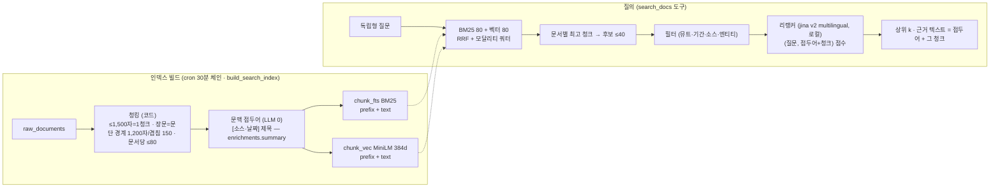

# 대화 검색 품질 — 청크 인덱스 · 문맥 접두어 · 리랭커 (C 단계, 2026-09-08)

> 상태: **구현됨 (D-132)**. 상위 설계는 docs/specs/chat-agent.md(B), 분석은 chat-harness.md §2-5.
> 레퍼런스: Anthropic *Contextual Retrieval*(청크 앞 문맥 → 임베딩+BM25, 실패율 −49%, +리랭킹 −67%, top-20) · 논문 2601.07711(리랭킹은 결정적 모듈이 에이전트보다 낫다) · phase2-rag.md "남은 것"(청킹·리랭커·필터).

## 0. 문제

- 문서 단위 임베딩(제목+앞 2,000자)이라 컨콜(평균 48K자)·유튜브 정리본(평균 22K자)은 2,000자 이후가 검색에서 사라진다. 장문 5,089건 = 전체 본문 31.7M자의 대부분.
- 종합에 넣는 근거 발췌가 **항상 문서 앞 1,200자**다. 질문과 맞는 문단이 뒤에 있으면 모델은 관련 없는 서두를 읽는다.
- 후보 40건 중 상위 16을 RRF 순서로만 고른다. 리랭커 없음.

## 1. 흐름

## 2. 결정

| 항목 | 선택 | 이유 · 기각 |
|---|---|---|
| 문맥 접두어 | **LLM 0**: `[소스·YYYY-MM-DD] 제목 — 요약(≤160자)` (요약은 태깅 때 이미 haiku가 만든 `enrichments.summary`, 98% 커버) | Anthropic 방식(청크별 haiku 문맥)은 장문 5,089건 × 문서 전체 입력 ≈ 20M 토큰·수십 시간. 접두어의 핵심 효과(청크를 문서 안에 위치시키기)는 제목+요약으로 대부분 얻는다. 청크별 LLM 문맥은 컨콜·유튜브(537건)에 한정한 업그레이드 경로로 남긴다 |
| 청크 크기 | 1,200자, 겹침 150, 문단 경계 우선, 문서당 ≤80 | 근거 발췌 상한(1,200자)과 일치. 281K자 문서는 96K자까지만(상한 명시) |
| 리랭커 | `jinaai/jina-reranker-v2-base-multilingual` (fastembed, 1.1GB, 로컬) — 실측 한국어 쌍 판별 정상, 40쌍 1.4초, 첫 로드 7.5분(1회 다운로드) | bge-reranker-base는 영·중만. ms-marco MiniLM은 영어. LLM 리랭크(haiku)는 턴당 콜 추가·비결정적. 미가용 시 RRF 순으로 degrade |
| 피드 검색 | 문서 단위 `search()` 유지 | 피드는 문서 목록이 결과라 문서 임베딩이 맞다. 청크 인덱스는 대화 근거 전용 |
| 실패 처리 | 청크 인덱스 비어 있으면 문서 단위로 자동 폴백 | 첫 빌드 전·확장 미가용 환경에서도 대화가 죽지 않게 |

## 3. 데이터

- `doc_chunks(id, doc_id, idx, text, prefix, content_hash)` — content_hash=원문 해시(변경 감지·멱등). 문서 삭제 시 빌드가 고아 청크 정리.
- `chunk_fts` FTS5(prefix, text) — rowid=chunk id, 빌드가 직접 동기화(트리거 없음: 청킹이 코드라 raw_documents 트리거로는 못 만든다).
- `chunk_vec` vec0(384d) — rowid=chunk id. `pipeline/chunks.py`가 sqlite-vec 연결에서 생성.
- 규모 추정: 단문 11K + 장문 31.7M/1.1K ≈ **40K 청크**, 벡터 ~60MB.

## 4. 코드

- `pipeline/chunks.py` — `chunk_text()` · `build_chunk_index(batch)`(변경·신규 문서만) · `search_chunks(q, k)`(RRF+쿼터 → 문서별 최고 청크).
- `pipeline/rerank.py` — `rerank(query, texts)` lazy 싱글턴, `RERANK_MODEL=""`로 비활성, import 실패 시 None.
- `pipeline/rag.retrieve_docs` — 청크 경로(후보 40 → 필터 → 리랭크 → k, excerpt=접두어+청크) / 폴백 문서 경로.
- `scripts/build_search_index.py` — 기존 문서 인덱스 + 청크 인덱스 순차 빌드(cron 체인 동일 위치).

## 5. 평가

같은 26문항(`eval_chat.py --label c-retrieval`)에서 B 대비: 인용 수·인용 누락 갭·근거 발췌의 질문 적합성(채점). 라우팅은 변화 없어야 한다(라우터 프롬프트 불변).

## 6. 남은 것

- 컨콜·유튜브 장문에 청크별 LLM 문맥(haiku low, content_hash 멱등, `--budget-calls`) — 채점에서 장문 근거 품질이 문제로 나오면.
- 청크 인덱스를 피드 검색에도 쓸지 — 문서 히트가 여러 청크로 흩어질 때 집계 규칙이 필요해 보류.
