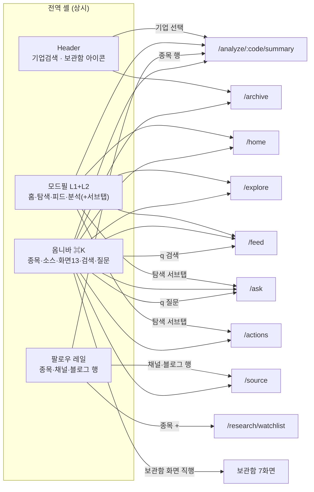
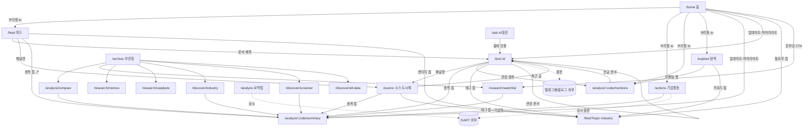

# IA 지도 — 페이지 진입로 & 화면 구성 (현행)

> UI/UX Phase 2 대개편의 기초자료. 2026-07-11 기준 코드 실측 (`App.tsx` Routes + 전 컴포넌트 링크 전수조사).
> 변경하면 이 문서가 아니라 개편 스펙을 새로 쓴다 — 이 문서는 "개편 전 스냅샷"으로 동결.

## 1. 라우트 인벤토리

### 활성 (1군 — 네비게이션에 노출)
| 라우트 | 페이지 | 노출 위치 |
|---|---|---|
| `/home` | 홈 (스트림) | 모드필 L1 |
| `/explore` | 탐색-신호 | 모드필 L1 + 탐색 서브탭 |
| `/ask` | AI 질문 | 탐색 서브탭 |
| `/actions` (`?view=pro`) | 기업활동 | 탐색 서브탭 |
| `/feed` (`?source·q·stock·industry·topic·page`) | 통합 피드 | 모드필 L1 + 피드 서브탭 |
| `/analyze/:code/{summary·financials·valuation·business·disclosures·mentions}` | 종목 도시에 6탭 | 모드필 L1(종목 선택 시) + 분석 서브탭 |
| `/doc/:docId` | 문서 상세 | 콘텐츠 링크 전용 (네비 없음) |
| `/source` (`?kind&key`) | 소스 도시에 | 콘텐츠 링크 전용 (네비 없음) |
| `/archive` | 보관함 (네비 허브) | Header 아이콘 |

### 보관함 (2군 — 라우트 유지, 네비에서 제거)
`/analyze/compare` · `/research/watchlist` · `/research/memos` · `/research/catalysts` · `/discover/industry` · `/discover/screener` · `/discover/alt-data`

### 리다이렉트 (레거시 호환)
`/`→`/home` · `/discover`,`/discover/signals`→`/explore` · `/industry`→`/discover/industry` · `/onchain`→`/discover/alt-data` · `/feed/telegram·blogs`→`/feed?source=` · `/research`→`/research/watchlist` · `/company/:code/:tab`→`/analyze/...` · **catch-all `*`→`/discover/industry`** ← 보관함 화면이 404 기본값 (개편 시 `/home`으로)

### 라우트 미등록 죽은 코드 (파일만 존재)
`MetricsPage` · `SignalFeedPage` · `TelegramFeedPage` · `BlogFeedPage` (사이드바 export도 FollowRail로 대체됨)

---

## 2. 진입로 Flow Chart

### 2-1. 전역 진입로 (모든 화면에서 상시 접근)

### 2-2. 페이지 간 콘텐츠 링크 (본문에서 나가는 경로)

### 2-3. 페이지별 진입로 매트릭스

| 도달 페이지 | 진입로 (전역 제외) | 진입 엣지 수* |
|---|---|---|
| **/analyze/:code/summary** | Header검색·옴니바·팔로우레일 + 홈·기업활동·피드·문서·소스·비교·워치리스트·스크리너·산업군 | **13+ (최대 허브)** |
| **/doc/:id** | 홈·AI질문·피드·문서(관련)·소스·언급탭 | 6 |
| **/feed?태그** | 홈·탐색·피드칩·문서·소스 (필터 싱크) | 5 |
| **/analyze/:code/mentions** | 탐색 모멘텀·문서 관련종목·홈 브리핑 | 3 |
| **/source** | 피드 채널명·문서 채널명·팔로우레일·옴니바 | 4 |
| /explore, /feed, /home | 모드필 (홈 브리핑→탐색 1) | 전역 |
| /ask | 탐색 서브탭·옴니바(질문 라우팅) | 2 |
| /actions | 탐색 서브탭·홈 브리핑·옴니바 | 3 |
| /archive | Header 아이콘·옴니바 | 2 |
| 보관함 7화면 | /archive 카드·옴니바 (+워치리스트는 팔로우레일·홈CTA) | 각 2~4 |
| 분석 나머지 4탭 (재무·밸류·사업·공시) | 분석 서브탭 **한정** | 1 |

\* 정적 코드 기준. `/analyze/:code/summary`가 압도적 싱크 — "모든 길은 종목 도시에로".

---

## 3. 화면 구성 (페이지별 해부)

### 전역 셸
- **Header**: 타이틀 / 기업검색 콤보(`/` 키 포커스) / 선택기업 배지 / ⌘K·보관함·테마토글
- **ModeNavigation** 2단: L1 모드필 4개(홈·탐색·피드·분석) + L2 서브탭(모드별 3~6개). 리서치 서브탭은 L1 없이 존재하는 고아 그룹
- **FollowRail**(우측 220px, 접기): 종목/채널/블로그 3섹션 — 행클릭=도시에, hover=수집토글, [+]=추가, 경고점(7일 유입 0)
- **Omnibar**(⌘K): 종목 → 소스 → 검색·질문 액션 → 고정 화면 13개

### 1군 페이지
| 페이지 | 섹션 (위→아래) | 특이 상태 |
|---|---|---|
| **홈** | 브리핑 3줄(변화 감지) → 이번주 일정 스트립 → 내 종목·팔로우 업데이트 → 시장 하이라이트 | 조용한 날: 하이라이트 상단 승격 / 워치리스트 0: 온보딩 CTA |
| **탐색** | 필터칩(신호타입×기간) → 언급 모멘텀(스파크라인) → 신호 성적표(백테스트) → 신호카드 그리드 | 모멘텀·백테스트는 n=0이면 숨김 |
| **AI질문** | 질문 입력(⌘Enter, `?q=` 프리필) → 답변(가설 스타일) → **갭 분석(일급 출력)** → 출처 인용 | 근거 없으면 "답할 수 없습니다" / ~30초 로딩 |
| **기업활동** | 뷰토글(목록/유무증Pro) + 유형 필터칩 → 테이블 | 시총 5,000억+ 한정 / `?view=pro` URL 상태 |
| **피드** | 하이브리드 검색바 → 활성 필터칩(제거·팔로우) → 문서카드(전문 펼침·이미지·엔티티칩) → 페이지네이션 | URL 쿼리=필터 단일 소스 |
| **문서 상세** | 헤더(소스·채널·태깅모델·원문) → AI요약 → 이미지 → 본문 raw → 관련문서(임베딩) → 관련종목 | 본문 없으면 이미지 참조 안내 |
| **소스 도시에** | 헤더(수집 통계) → **관점 프로필(LLM 게으른 생성)** → 주로 다루는 것(90일 집계 칩) → 최근 글 | 프로필 생성중/실패/미생성 3상태 |
| **보관함** | 아카이브 화면 카드 7개 | 순수 네비 허브, API 없음 |

### 종목 도시에 (분석 6탭)
| 탭 | 섹션 | 내부 링크 |
|---|---|---|
| 요약 | KPI 스트립(+워치 버튼) → 캔들+상대수익률 → 실적 그래프·표(컨센서스) → 최근공시+투자논점 | DART 외부만 — **내부 dead-end** |
| 재무정보 | 컨트롤(IS/BS/CF·연간/분기·연결/별도) → 차트/테이블 | 없음 (dead-end) |
| 밸류에이션 | 기간칩 → PBR밴드·PER·EPS 3열 | 없음 (dead-end) |
| 사업정보 | 세그먼트 탭+수동입력 폼 → 파이+스택막대 → 테이블 | 없음 (dead-end) |
| 공시 | 서브탭(공시/IR메모) → 필터+테이블 / 메모 CRUD | DART 외부만 |
| 언급 | 1D·7D 다이제스트(새로운 시각) → 매칭 키워드(승인 큐) → 신호이력 → 언급 문서 | /doc — **spine과 연결된 유일한 탭** |

### 보관함 화면 (요약)
비교(지표 테이블, `?stocks=`) / 워치리스트 관리(인라인 편집) / 투자메모(Bull·Bear·Catalyst·Risk 4분면) / 카탈리스트(수동 이벤트) / 산업군(밸류체인 맵) / 스크리너(재무 필터+히트맵) / 대안데이터(Hyperliquid·Polymarket)

---

## 4. Phase 2를 위한 구조 관찰 (진단만 — 처방은 개편 스펙에서)

1. **허브 비대칭**: 모든 길이 `/analyze/:code/summary`(13+ 엣지)로 모이는데, 정작 요약 탭은 spine(피드·문서·소스)과 단절된 dead-end. 언급 탭만 연결됨. 유입 최다 페이지가 구세대 화면.
2. **dead-end 페이지 7개**: 분석 4탭(재무·밸류·사업·공시)·투자메모·카탈리스트·대안데이터 — 소비 후 여정 단절.
3. **네비 계층 불일치**: `/ask`·`/actions`는 "탐색"의 서브탭인데 탐색(신호)과 성격이 다름. 리서치 서브탭 그룹은 L1 모드 없이 고아로 존재.
4. **콘텐츠 전용 페이지의 발견성**: `/doc`·`/source`는 네비에 없음(의도된 도시에 프리미티브) — 단 소스 도시에는 옴니바·레일로 보완됨, 문서는 순수 흐름 의존.
5. **두 세대 공존**: 1군(spine: 홈·피드·문서·소스·탐색)과 2군(수동 CRUD: 메모·카탈리스트·산업군 등)이 같은 셸에 있으나 데이터가 서로 안 흐름. 예: 카탈리스트(수동)와 홈 캘린더(자동)가 별개.
6. **catch-all이 보관함 화면**(`*`→`/discover/industry`) — 잘못된 URL이 아카이브로 떨어짐.
7. **죽은 코드 4파일** (라우트 미등록): MetricsPage·SignalFeedPage·TelegramFeedPage·BlogFeedPage.
