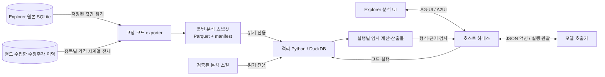

# 시장 데이터 CodeAct 분석

> 상태: **첫 버전 구현·검증** (2026-09-19). macOS 로컬 실행, 보유 데이터 기준 잠정 분석.
> 사용자 요구: Explorer의 기존 시장 데이터를 활용하고, 에이전트의 분석은 조회·계산으로 제한한다. 기존 DB의 삭제·덮어쓰기·갱신을 허용하지 않는다.
> 상위 문서: [SYSTEM](../SYSTEM.md), [설계 철학](../PHILOSOPHY.md).
> 관련 계약: [대화 에이전트](chat-agent.md), [기존 재무 스크리너](discover-screener.md), [기업 상세·차트](company-research.md).
> 기존 대화의 **시장 분석** 버튼으로 진입한다: `/chat?mode=analysis`. 일반 대화와 별도 실행·이력을 사용한다.
> 제품 방향(D-180): 자연어로 종목을 발견하고, 유용한 검색을 저장·추천받고, 발견 맥락을 기존 기업 리서치·팔로우업으로 이어간다. 백테스트는 보조 도구다. 아래 §10은 **후속 설계이며 아직 구현되지 않았다**.

## 1. 목표와 첫 범위

사용자가 자연어로 제시한 시장 조건을 모델이 SQL/Python으로 조합하고, 실제 계산 결과와 종목별 근거를 반환한다. 첫 대상은 국내 주식의 시가총액·일봉 OHLCV·이동평균·52주 신고가·역헤드앤숄더다.

예시: 시총 5,000억원 이상, 최근 90거래일 내 역헤드앤숄더와 넥라인 돌파, 그 이후 52주 신고가, 최근 14거래일 동안 20일선 유지.

- 원천은 Explorer의 `stock_prices`·`companies` 및 별도 수집한 `market_history.sqlite`다(D-177). PoC 데이터셋을 운영 원천으로 합치지 않는다.
- 모델은 분석 방법과 코드를 만들 수 있다. 원천 데이터 수집·보정·재적재·스키마 변경을 수행할 권한은 없다.
- 허용하는 쓰기는 실행별 임시 계산 파일과 JSON·CSV·PNG 산출물이다. 모델 생성 코드를 호스트 Python 프로세스에서 `exec`/`eval`/`import`하지 않는다.
- CodeAct의 첫 범위는 현재 보유 자료에 대한 종목 검색이다. 전략 수익률 비교는 별도의 [고정 계산 백테스트](market-backtest.md)로 구현했다(D-179). 주문·자동매매, 자동 스킬 배포, 외부 웹 수집, 미국 시장 확대는 후속 범위다.

## 2. 코드·데이터 확인 결과

2026-09-18 로컬 조회 및 PoC 검사 결과이며 지속적으로 보장되는 수치가 아니다.

| 항목 | 관찰 |
|---|---|
| Explorer 시세 | 2,992종목, 865,647행. 최신일 2026-09-18 |
| 최신일 시총 5,000억원 이상 | 488종목. 이 중 최근 90거래일 구간 전체에서 직전 365일을 볼 수 있을 만큼 이력이 일찍 시작하는 종목은 28개. 중간 누락까지 검사한 완전성 수치는 아님 |
| 시총 이력 | `stock_prices.market_cap` 결측 696,848행. 최신 시총 필터와 과거 시총 필터의 지원 범위를 구분해야 함 |
| 데이터 출처 | 일일 FDR 스냅샷, FDR 백필, 다른 시세 서비스 경로가 존재. 현재 가격 테이블에는 행별 수정주가 기준·공급자 이력 필드가 없음 |
| 기존 DB 연결 | `backend/database.py:get_connection`은 쓰기 가능한 연결과 WAL 설정을 사용 |
| 조회의 부작용 | `services/krx_service.py:fetch_stock_prices`는 캐시 미스 시 수집·DB 저장을 수행. 분석 exporter에서 호출하지 않음 |
| 기존 대화 | `pipeline/chat.py:run_turn`은 도구 수집→추가 검토→답변 합성. SSE는 자체 status/delta/done 형식 |
| PoC | `../projects/code-as-a-tool/`. CodeAct 루프, 예산, 중단/재개, AG-UI, A2UI v0.8, 산출물 조회 구현 |
| PoC 검증 | 제어 테스트 23건·샌드박스 검사 19건 통과. 데이터 검사 10건 중 1건 실패(시가·저가 0인 행). 새 분석 경계의 검증을 대체하지 않음 |

관련 코드: [DB 연결](../../backend/database.py), [기존 시세 수집](../../scripts/ingest_prices.py), [시세 서비스](../../backend/services/krx_service.py), [대화](../../backend/pipeline/chat.py).

## 3. 데이터와 실행의 경계

원본 DB에 접속하는 것은 개발자가 작성한 exporter뿐이다. 모델이 생성한 SQL은 스냅샷을 대상으로 격리 환경 안에서 실행한다. 원본 DB 경로나 연결 객체를 전달하지 않고, 경로를 추측해도 런타임 정책이 접근을 차단해야 한다.

### 3.1 원본에서 스냅샷으로

1. 별도 읽기 전용 연결을 만든다. SQLite URI `mode=ro`, `uri=True`와 보조적인 `query_only`를 사용한다. 공용 `get_connection`, `init_db`, 캐시 갱신·수집 함수를 사용하지 않는다.
2. 조회 테이블·컬럼과 SQL은 exporter의 고정 allowlist다. 입력은 검증된 기준일·시장·기간 등 타입이 정해진 값이다. 모델 SQL·파일 경로·SQL 조각을 호스트 조회에 전달하지 않는다.
3. 하나의 읽기 트랜잭션에서 시세와 종목 정보를 읽는다. DB 연결을 닫은 뒤 모델 실행을 시작하며 export 시간에도 제한을 둔다.
4. 별도 임시 출력에 Parquet와 manifest를 만들고 검증 후 새 snapshot ID로 게시한다. 실행 도중 입력 파일을 교체하지 않는다. 재개는 같은 snapshot ID와 해시를 사용한다.
5. 대화·개인 노트 등 다른 테이블은 내보내지 않는다. 모델에 제공할 스키마 설명도 내보낸 데이터 범위로 제한한다.

**D-177 수집 보강**: 신뢰된 ETL `scripts/collect_market_history.py`가 NAVER/FDR의 일봉을 별도 staging에서 검증하고 `backend/db/market_history.sqlite`로 원자적으로 게시한다. exporter만 이 파일을 `mode=ro`로 연결하며, 수집된 종목의 OHLCV 전체는 해당 소스를 사용하고 원본의 같은 날짜 시총·주식수를 연결한다. 과거 정상 원본 가격과 새 수정주가를 날짜별로 혼합하지 않는다. 미수집 종목은 기존 원천을 유지하고 출처 미확인으로 표시한다. 이력의 수집 기준일보다 원본 최신일이 새로우면 수집일까지만 계산하고 갱신 경고를 표시한다. 이전 실행의 불변 스냅샷은 바뀌지 않는다.

`mode=ro`는 연결을 읽기 전용으로 여는 설정이다. `query_only`만으로 완전한 읽기 전용 경계를 만들 수는 없다. 또한 변경되는 운영 DB에 `immutable=1`이나 `nolock=1`을 적용하지 않는다. [SQLite URI](https://www.sqlite.org/uri.html), [query_only 설명](https://www.sqlite.org/pragma.html#pragma_query_only).

Explorer는 WAL을 사용하므로 실행 중인 `.db` 파일만 파일 복사해서 스냅샷으로 삼지 않는다. 한 읽기 트랜잭션에서 논리 데이터를 export하고, 오래 열린 읽기가 checkpoint를 지연시키지 않도록 연결을 짧게 유지한다. 읽기 연결도 WAL/SHM 조정에 참여할 수 있으므로 “운영 디렉터리에 바이트 쓰기가 전혀 없다”와 “업무 데이터·스키마를 변경하지 않는다”를 혼동하지 않는다. [SQLite WAL과 읽기 트랜잭션](https://www.sqlite.org/wal.html#concurrency).

### 3.2 권한 표

| 자원 | CodeAct 실행 코드 | 호스트의 역할 |
|---|---|---|
| 원본 DB, WAL/SHM, DB 상위 디렉터리 | 읽기·쓰기·삭제·이름 변경 금지 | exporter만 고정 조회 |
| 앱 소스, `.env`, 인증 정보, 홈 디렉터리 | 접근 금지 | 모델 호출 인증은 호출기에만 제공 |
| 현재 실행의 분석 스냅샷·검증된 스킬 | 읽기만 | exporter·개발 배포 경로만 생성 |
| 현재 실행의 scratch/output | 읽기·쓰기 가능 | 결과 파일만 검증해 제공 |
| 다른 실행의 데이터·결과 | 접근 금지 | 서버가 run 소유 관계 검증 |
| 실행 스크립트·격리 정책·상태·이벤트 로그 | 수정 불가 | 하네스가 별도 관리 영역에 저장 |
| 네트워크·localhost API·소켓 | 금지 | 모델 호출은 격리 코드 밖에서 수행 |

읽기 전용 정책은 프롬프트나 SQL 키워드 차단에 의존하지 않는다. 모델이 다른 SQLite 연결을 열거나 Python 파일 API·하위 프로세스를 사용해도 같은 OS 경계가 적용돼야 한다. 스냅샷의 파일 권한 변경으로 쓰기 제한을 해제하는 것도 차단한다.

### 3.3 PoC에서 변경할 실행 경계

- 현재 macOS의 `sandbox-exec` 어댑터를 첫 검증 대상으로 삼는다. 원본·프로젝트 전체를 허용하지 않는 명시적 읽기 경로와 실행별 쓰기 경로를 사용하고, 불필요한 IPC 허용을 줄인다. 생성 코드가 로컬 앱에 쓰기를 대신 요청하는 우회도 검사한다.
- 모델 호출기는 Python 실행 도구를 직접 갖지 않는다. CLI의 내장 도구·MCP·프로젝트 설정·훅을 통해 우회 실행하지 못하는 구성을 검증한다. 엔진 변경 시 같은 검사를 다시 수행한다.
- 프로세스에 원본 DB 파일 디스크립터·소켓·자격증명·넓은 환경변수를 상속하지 않는다. 분석 전용 Python 환경을 사용한다.
- PoC는 `.sandbox.sb`와 다음 `.step_*.py`를 에이전트가 쓰는 workdir 안에 호스트 권한으로 쓴다. 해당 경로를 심볼릭 링크로 바꿀 수 있다는 위험을 제거하기 위해 정책·스크립트는 호스트 관리 영역에 두고 샌드박스에는 읽기만 제공한다. 호스트의 파일 생성·결과 읽기·정리에서도 symlink/hardlink와 경로 이탈을 거절한다.
- 기존 `forwardedProps.dataDir/network`, 임의 mount·환경변수·명령 설정을 외부 입력으로 받지 않는다. 서버가 run ID와 정책을 결정하며 모델·UI 응답으로 완화할 수 없다.
- 모델이 `save_skill`을 요청해도 활성 스킬이나 앱 소스를 덮어쓰지 않는다. 생성 코드는 해당 실행의 후보 산출물로만 남기며, 검증·배포는 별도 개발 작업이다.
- stdout/stderr는 제한 크기로 읽고 초과분을 버리거나 실행을 중단한다. 종료 후 문자열만 자르는 방식으로 메모리를 무제한 소비하지 않는다. 시간·출력·파일 크기·scratch 사용량 제한과 프로세스 그룹 종료를 적용한다.
- 첫 버전은 동시 분석 1개로 시작한다. macOS seatbelt는 완전한 프로세스·메모리 격리가 아니므로 자원 한계도 명시한다. 원본 보호 또는 필요한 자원 경계를 충족하지 못하면 실행을 차단하고 VM/컨테이너 어댑터로 전환한다. 격리 없는 subprocess로 폴백하지 않는다.

### 3.4 저장 위치의 역할

루트는 Git에서 제외된 `logs/market-analysis/`다. 관리 영역이나 입력 스냅샷이 scratch의 자식이 되면 안 된다.

- `snapshots/<snapshot_id>/`: `daily.parquet`, `universe.parquet`, `manifest.json`. 불변 입력.
- `runs/<run_id>/`: 조건, 상태, 이벤트, 실행 코드 사본, 검증 결과. 하네스만 쓰기.
- `workspaces/<run_id>/`: 계산 중간물·모델 생성 산출물. 격리 실행만 쓰기.
- `control/<run_id>/`: 모델 요청·고정 스킬 사본·격리 정책·실행 감독기. 검증 계산은 별도 `workspaces/<run_id>-verify/`에서 실행한다.

기존 DB에는 첫 버전의 분석 결과를 자동 적재하지 않는다. 대화에는 기존 호스트 저장 로직을 통해 run 참조만 연결할 수 있다. 결과를 기존 자료·메모로 저장하는 기능은 별도 사용자 액션으로 설계한다. 정리는 완료된 실행 전용 디렉터리만 대상으로 하며 사용 중인 스냅샷은 보존한다.

## 4. 시장 데이터 계약

- 표준 일봉: `code`(숫자·영문 대문자 6자리 문자열), `date`(시장 날짜), `open/high/low/close/volume`, `mktcap`, `shares`. 시총 단위는 원이다. 실제 원천의 `0001A0`, `00088K` 같은 코드를 보존한다. 스키마 이름 변환은 exporter에서 처리한다.
- 종목 정보: 종목코드·이름·시장·종목 유형과 그 확인 상태. 이름 연결 실패로 시세 종목을 조용히 누락시키지 않는다. 보통주 여부 등 미확보 필터는 확인 불가로 남긴다.
- manifest: schema 버전, snapshot ID·파일 해시, export 시각, 요청 기준일, 실제 자료 기준일, 종목별 보유 기간·행 수·결측, 가격 조정/출처 확인 상태, 거래일 달력 출처·버전, 적용한 제외 규칙과 건수.
- 원본에 없는 수정주가 출처나 조정 여부를 만들어 채우지 않는다. 표본 대조와 기존 수집 경로 점검 후 지원 범위를 정하고, 확인되지 않은 구간은 패턴 판정을 미검증으로 표시한다.
- 분석 기준일은 한 실행에서 고정한다. 시총은 그 기준일의 값을 사용하며 종목별 마지막 보유일이 다르다는 이유로 오래된 시총을 현재 시총처럼 대체하지 않는다.
- 거래일은 주말만 제외한 달력 일수와 구별한다. 휴장·거래정지·데이터 누락을 구분할 수 있는 시장 공통 달력/품질 정보를 준비한다. 현재 가격 행의 합집합은 잠정 가용일 목록일 뿐 완전한 거래소 달력으로 표현하지 않는다.
- 52주 돌파는 **판정일 종가 > 판정일을 제외한 직전 365일의 고가 최댓값**이다. 동률은 돌파가 아니다. 판정 날짜마다 필요한 이력과 누락을 검사한다. 단순히 `nprev > 0`인 종목을 52주 판정에 포함하지 않는다.
- 최근 90거래일에 발생한 신고가를 확인하려면 그 구간의 가장 이른 판정일보다 365일 전부터 자료가 필요하다. 피벗·선행 하락·이평선 계산의 추가 이력도 조건으로부터 산정한다.
- OHLC 모순·0·중복·누락을 실행 전에 점검한다. 값을 임의 보간해 통과시키지 않고 분석용 제외와 사유를 남긴다. 원본을 고치지 않는다.
- 신규 상장·이력 부족·기준일 누락은 조건 탈락과 구별한다. 요청 대상 수, 평가 가능 수, 통과 수, 탈락 수, 미평가 수를 함께 제공한다.
- 전체 요청 대상에 필요한 검사가 끝난 0건은 정상 완료다. 일부만 계산한 0건은 전체 시장에 해당 종목이 없다는 뜻이 아니다.

백필·수정주가 보강은 **별도의 ETL 작업**이다. 이번 분석 기능의 실패 복구나 `ask_user` 응답이 이를 실행하지 않는다. 필요 범위와 변경 방법을 먼저 제시한 뒤 기존 수집 경로에서 수행하며, 현재 계획 작성에서는 DB 변경·백필을 실행하지 않는다.

## 5. 조건 해석과 분석 스킬

**D-178 확장**: [전략 도구 카탈로그](market-strategies.md)의 50개 조건을 `strategy_conditions`로 지정한다. `mode=catalog`는 기존 패턴 기본 조건을 끄며, `mode=pattern`에 조건을 더하면 기존 복합 조건의 통과 종목에 추가 적용한다. 12개까지 AND로 조합하며 순위는 같은 평가 가능 집합에서 독립 계산한다. 선택 화면은 검증된 `RunRequest.spec`으로 모델 호출 없이 실행하고, 자연어는 카탈로그의 ID·매개변수·정의를 참고해 해석한다. 두 경로 모두 스냅샷·OS 격리·실행 관찰·독립 재계산·산출물 계약이 같다. `analytics.py`, `strategies.py`, `strategy_screen.py` 전체를 해시로 고정한다.

요청을 `AnalysisSpec`으로 정규화한다: 시장·유니버스, 기준일, 시총 조건·시점, 패턴 정의·버전, 탐색 기간, 사건 순서, 신고가 기준, MA 기간·종류, 이탈 판정 가격, 데이터 부족 정책.

예시 질의에서는 다음을 보존한다.

| 조건 | 계획상 처리 |
|---|---|
| 시총 5,000억원 이상 | `mktcap >= 500_000_000_000`, 분석 기준일 기준 |
| 최근 90영업일 | 거래일 기준. 패턴 전체가 이 구간에 있어야 하는지, 넥라인 돌파일만 포함하면 되는지는 해석을 확인 |
| 역헤드앤숄더 | 피벗 폭·어깨 허용 오차·선행 하락·넥라인 정의를 버전과 함께 명시. PoC의 60봉 기본값을 90일 요청에 조용히 대입하지 않음 |
| 그 이후 52주 신고가 | 돌파 뒤~기준일 범위로 계산. 임의로 14거래일 이내 조건을 추가하지 않음. 같은 날 포함 여부는 명시 |
| 최근 14영업일 20일선 유지 | SMA20을 초기 제안으로 사용하되 종가 기준/장중 저가 기준을 명시. MA5로 대체하지 않음 |

필수 모호성만 A2UI의 짧은 조건 폼으로 한 번에 확인한다. 이미 명시된 조건을 다시 묻지 않으며, 사용자가 바꾸지 않은 조건은 재실행·후속 질의에서도 보존한다. A2UI는 분석 조건을 받으며 DB 쓰기 권한을 부여하는 인터페이스가 아니다.

역헤드앤숄더·52주·MA 유지·시총 필터를 파라미터화한 검증된 함수로 제공한다. 모델은 이들을 자유롭게 조합하고 추가 계산 코드를 작성할 수 있다. 신규 계산은 자동으로 검증된 스킬과 같은 지위를 얻지 않는다.

첫 역헤드앤숄더 정의는 `consecutive-pivots-v1`이다. 좌우 봉으로 확정한 **연속된 저점 피벗 3개**와 그 사이 고점, 선행 하락·최소 깊이·어깨 허용 오차를 검사한다. PoC의 모든 저점 삼중 조합 탐색과 달라 결과가 같다고 주장하지 않는다. 코드·스킬 해시와 피벗 확정일을 보존한다. 지원 범위를 벗어난 요청은 `unsupported_conditions`로 표시하고 전체 완료로 처리하지 않는다.

결과 검증은 두 층으로 나눈다.

1. 모든 실행: 스키마, 실제 종목/거래일 존재, 입력 해시, 실행 관찰, 조건 누락, 집계 일치, 사건 선후관계 검증.
2. 첫 버전의 지원 조건: 버전이 고정된 검증기로 후보의 수치·날짜와 탈락/미평가 구분을 독립 재계산. 검증기도 같은 제한 입력을 사용하며 생성 코드를 호스트에서 실행하지 않는다.

피벗 확정에 미래 봉이 필요한 경우 확정 가능일을 저장한다. 과거에 실시간으로 탐지할 수 있었던 신호와 사후적으로 발견한 패턴을 구분하며, 이번 검색 결과를 백테스트 성과로 해석하지 않는다.

## 6. 하네스·API·상태 계약

- `run_python`, `ask_user`, `finish`를 실행 액션으로 둔다. PoC의 비용·시간 예산, 반복 감지, 관찰 ID, 마지막 결과 정리 로직은 재사용한다.
- JSON 출력은 호스트 스키마 검증을 통과해야 한다. 거절된 액션은 실행되지 않은 것으로 기록한다.
- 실행 상태: `queued → preparing → running ↔ waiting_input → completed/partial/blocked/failed/cancelled`. 서버 재시작으로 실행 여부가 불명확한 단계는 `interrupted`로 표시한다.
- 조건, snapshot/skill 버전·해시, 코드, 관찰, 비용·시간, 산출물, 검증 결과를 저장한다. 중단/재개에 예산과 근거를 유지한다.
- 실행별 잠금과 idempotency key로 중복 시작·재개를 막는다. resume의 interrupt ID·상태·run 연결을 검증한다. 브라우저 재연결은 기존 이벤트를 재생하며 모델을 다시 호출하지 않는다.
- UI 연결 종료와 작업 취소를 구분한다. 명시적 취소는 모델/계산 프로세스 그룹 종료까지 확인하고, 취소 이후 액션을 실행하지 않는다. 준비 작업도 취소 가능해야 한다.
- AG-UI의 전송 종료와 과업 완료를 구별한다. `complete/partial/blocked` 및 미검증 항목을 결과 계약에 명시한다.
- 원천 DB 경로나 네트워크 허용 설정은 API 입력 스키마에 없다. 첫 버전에서는 실행마다 코드 승인 창을 띄우지 않고 고정된 조회 전용 권한 안에서 자동 실행한다.

구현 API:

| 요청 | 역할 |
|---|---|
| `POST /api/analysis/runs` | 질문·기준일·선택 조건으로 run 생성 |
| `GET /api/analysis/runs` | 최근 실행 목록 |
| `GET /api/analysis/runs/{id}` | 상태·조건·결과 조회 |
| `GET /api/analysis/runs/{id}/events` | AG-UI 이벤트 구독·재생 |
| `POST /api/analysis/runs/{id}/resume` | 조건 확인 응답과 중단 지점 연결 |
| `POST /api/analysis/runs/{id}/cancel` | 작업 취소 |
| `GET /api/analysis/runs/{id}/artifacts/{artifact_id}` | 서버에 등록된 안전한 결과 파일 조회 |
| `GET /api/analysis/runs/{id}/chart/{code}` | 검증된 후보의 동일 스냅샷 차트·MA·마커 |

산출물은 크기·타입·경로를 검사한 JSON/CSV/PNG만 제공한다. HTML/JavaScript나 pickle을 호스트에서 실행·역직렬화하지 않는다. 다운로드·미리보기 시에도 경로 검사를 반복하고 CSV의 스프레드시트 수식 해석 위험을 처리한다.

## 7. 화면 초안

첫 진입은 기존 대화 화면의 명시적인 **시장 분석** 모드다. 일반 대화의 자동 라우팅 확대는 초기 품질 검증 뒤 결정한다. run ID와 대화 연결을 URL에 보존하고 기존 대화 생성과 분석 실행의 이벤트를 분리한다.

사용 흐름: 질문 → 필요한 조건 확인 → 데이터 범위/기준일과 분석 진행 → 결과 표 → 종목별 근거·차트 → 기존 기업 상세로 이동.

- 기본 화면: 질문·조건 요약, 자료 기준일, 대상/평가 가능/미평가 종목 수, 진행 단계, 취소.
- 결과: 종목·시총, 패턴/넥라인/신고가 날짜, MA 유지 판정, 조건별 통과/탈락/미검증, CSV 다운로드.
- 상세: 기존 캔들 차트에 어깨·머리·넥라인·돌파·MA 표시. 보이는 마커는 검증된 결과의 거래일·가격과 일치해야 한다.
- 코드·로그·예산 상세는 접힌 실행 기록에서 제공한다. 사용자에게 필요한 조건과 근거를 기본으로 보여준다.
- 오류나 데이터 부족이 발생해도 사용자의 요청 조건을 자동 완화하지 않는다.

| 상태 | 표시 |
|---|---|
| Empty | 질문 예시. 평가 완료 후 0건이면 검사 범위·조건과 함께 0건 표시 |
| Loading | 준비/분석/검증 단계와 실제 레이아웃 스켈레톤, 취소 |
| Partial | 확인된 결과를 먼저 제공하고 미평가 종목·조건과 이유 표시 |
| Error | 격리 시작 실패·모델 오류·결과 불일치를 구별. 재시도 시 기존 run을 덮어쓰지 않음 |
| Ideal | 검증된 결과 표·차트·조건·기준일·기업 상세 링크 |

통과 0개이고 미평가 종목이 있으면 제목을 **데이터 부족으로 검색 결과 미확정**으로 표시한다. 집계는 요청 대상·통과 확인·조건 탈락·판단 불가로 구분한다. 시총 단계의 탈락을 모든 가격 조건의 평가 완료처럼 표시하지 않는다. 미평가 사유별 건수와 종목별 보유/필요 기간을 표시하며, 동일 데이터 재실행이 누락을 해결하지 않음을 안내한다.

## 8. 구현 순서와 완료 기준

각 단계의 검증이 끝난 뒤 다음 단계로 진행한다. 특히 1단계 경계 검증 전에 원본 DB를 사용하는 모델 실행을 붙이지 않는다.

| 단계 | 작업 | 완료 기준 |
|---|---|---|
| 1. 원본 보호 | 읽기 전용 exporter, 실행 입력/관리/scratch 분리, 격리 어댑터 | 임시 DB fixture에서 SQL·파일·링크·네트워크 우회와 원본 불변 검사 통과. 격리 실패 시 실행 차단 |
| 2. 데이터 적합성 | Explorer 컬럼 변환, manifest·품질/이력 검사, 수정주가·거래일 지원 범위 | 보유 데이터로 평가 가능/불가를 재현 가능하게 분류. 별도 ETL이 필요한 범위 산출 |
| 3. 결정적 계산 | 시총·역H&S·52주·MA 스킬과 결과 검증 | 합성 fixture의 양성/음성·경계값·신규상장·결측·선후관계 기대값과 일치 |
| 4. CodeAct 연결 | PoC 루프 이식, 결과 계약, 예산·취소·재개·이벤트 저장 | 실제 관찰 없는 완료·조건 누락·중복 실행을 처리하고 독립 계산과 일치 |
| 5. Explorer UI | AG-UI/A2UI, 조건 폼·표·차트·과거 실행 | 5-state, 재연결·취소·재개, 기업 상세 연결 확인. 대표 질의 실제 모델 실행 평가 |

실제 모듈: `backend/pipeline/market_analysis/`의 `snapshot.py`, `analytics.py`, `runtime.py`, `process_guard.py`, `model.py`, `runner.py`, `store.py`, `protocol.py`; `backend/models/market_analysis.py`, `backend/routers/analysis.py`, `frontend/src/components/analysis/`, `hooks/useMarketAnalysis.ts`.

### 원본 보호 검증의 필수 사례

실제 운영 DB에 파괴 시도를 하지 않는다. 운영과 같은 디렉터리/WAL 구조를 가진 임시 원본 fixture와 보호 파일로 검사한다.

- 정상 SELECT와 통계 계산, 현재 실행의 결과 파일 생성은 성공.
- 원본에 대한 INSERT/UPDATE/DELETE/DROP/ALTER, 별도 연결·ATTACH, 직접 파일 쓰기·truncate·unlink·rename·상위 디렉터리 삭제는 실패.
- 다른 실행·입력 스냅샷·활성 스킬·관리 상태·실행 스크립트/정책 수정은 실패.
- scratch에 만든 symlink/hardlink, 경로 이탈, 같은 경로의 교체를 통한 호스트 쓰기/읽기/정리 우회는 실패.
- localhost의 기존 수집/변경 API, 외부 네트워크, 소켓/IPC를 통한 대리 실행은 실패.
- 격리 실행파일 부재·정책 오류·입력 변조는 일반 subprocess로 재시도하지 않음.
- 취소·시간 초과 후 하위 프로세스가 남지 않고 다음 액션이 실행되지 않음.
- 정지 상태 fixture는 전후 파일 해시·스키마·논리 행 및 무결성이 동일. 별도 동시성 fixture에서는 허용된 수집기의 커밋만 반영되고 exporter/CodeAct가 변경을 추가하지 않음.
- export 중 원천 갱신이 있어도 게시된 스냅샷 내부 일관성이 유지되고, 재개 실행은 최초 스냅샷을 사용.

### 분석 검증의 필수 사례

- 사용자 예시를 기준 계산과 대조. 시총·90거래일·사건 순서·MA20 조건 누락 시 완료로 처리하지 않음.
- 같은 날 돌파, 동률 고가, MA와 같은 종가, 14일 중 하루 이탈, 휴장·거래정지·이력 부족, 피벗 확정 시점을 검사.
- 결과 0건과 데이터 부족·예산 초과를 구별. 범위가 좁아졌는데 전체 시장 검증이라고 답하면 실패.
- 기존 PoC의 과거 100종목/MA5 결과는 참고 기록이며 MA20·Explorer 데이터의 정답 검증으로 재사용하지 않음.

## 9. 실행과 검증 기록

앱 의존성 설치 후 저장소 루트에서 `sh scripts/setup_market_analysis.sh`를 실행한다. 별도 `.analysis-venv`와 실제 OS 격리 검사를 준비한다. macOS `sandbox-exec`와 도구·훅·MCP 차단 옵션을 지원하는 인증된 Claude CLI가 필요하다. 기본 모델은 `sonnet`, 서버 환경변수 `MARKET_ANALYSIS_MODEL`로 선택한다. CLI는 `MARKET_ANALYSIS_CLI`를 지정하면 해당 실행파일을, 아니면 `PATH`에서 찾는다. 여러 버전이 설치돼 있으면 오류에 표시되는 실행파일과 누락된 격리 옵션을 확인한다. 필요한 옵션이 없을 때 보안을 낮춰 실행하지 않는다.

- 하네스: 동시 실행 1개, 실행당 모델 비용 추정 $3·활성 시간 900초·모델 호출 60회 상한. 비용을 확인하지 못한 중단 호출이 있으면 재호출을 차단한다. 입력 대기는 활성 시간에서 제외한다.
- 런타임: 계산 1회 최대 90초, 독립 검증 최대 120초, 출력 합계 128KiB, 파일당 32MiB, scratch 128MiB/1,024개. 부모 API가 강제 종료되어도 별도 감독기가 계산·모델 프로세스 그룹을 종료한다. 완전한 메모리/VM 격리는 제공하지 않는다.
- 고정 의존성: 앱 `duckdb==1.5.5`, `pyarrow==25.0.1`, `ag-ui-protocol==0.1.22`; 분석 환경은 설정 스크립트의 숫자 계산 패키지만 설치. UI `@ag-ui/core==0.0.59`, `@a2ui/react==0.11.1`. A2UI v0.8 폼의 선택 바인딩·레이블은 등록한 Radix 기반 컴포넌트로 표시한다.
- 임시 DB를 대상으로 SQL·파일·링크·네트워크·자식 프로세스 우회, 취소/시간·출력 제한, API 강제 종료를 검사했다. 운영 DB를 파괴 대상으로 사용하지 않았다. 결정적 계산·하네스 검사는 `backend/tests/test_market_analysis_{runtime,data,harness}.py`에 있다.
- 실제 모델 대표 질의: 합성 양성/음성 2종목에서 조건 해석→Python 생성·실행→완료 3회 호출, Python 1단계로 후보 1개를 찾고 독립 재계산과 일치. 원천 fixture 해시 동일. 가격 보정/달력 출처 미확인 때문에 정직하게 `partial`을 반환한다. 기록: `logs/market-analysis-smoke/83bc13920f1f449d813e2129a0f69bf2/summary.json`.
- 실제 시장 스냅샷의 모델 실행도 완료했다. 4회 모델 호출·Python 2단계로 2,992종목을 계산하고 독립 검증과 일치, 공급자 비용 추정 $0.104. 아래 read-only 점검의 고정 스냅샷을 재사용했으며 원본 DB를 다시 열지 않았다. 기록: `logs/market-analysis-smoke/real-33903628972045469b66b1957de00d77/summary.json`.
- 실제 원천 읽기 전용 점검(2026-09-19, 시세 기준일 9/18): 865,647행·2,992종목 전체 export. 시세·기업정보·스키마의 전후 해시 동일. 기본 복합 조건은 후보 0개, 평가 2,381개·미평가 611개(이력 부족 460, OHLCV 오류 27, 기준일 누락 123, 관측 거래일 누락 1). **전체 시장에 해당 종목이 없다는 결론이 아니다.** 기록: `logs/tmp/market-data-smoke-caf_q6cd/summary.json`.
- 최종 자동 검사: 백엔드 50건·프론트 프로토콜/재생 5건 통과, `npm run build` 통과, 앱 OpenAPI에 분석 API 등록 확인. 브라우저에서는 API fixture와 실제 A2UI 폼을 사용해 선택 복원·재개·취소·이벤트 재생·차트·390px 화면을 검증했다(페이지 오류 0). 기록/스크린샷: `logs/market-analysis/verification/`. 저장소의 기존 ESLint 설정 파일이 없어 `npm run lint`는 실행되지 않는다.

### 2026-09-19 데이터 수집 후 검증(D-177)

사용자의 수집 요청에 따라 2,992종목의 최근 2년과 더 오래된 가격 오류 구간을 NAVER/FDR에서 수집했다. 검증된 1,374,352행을 별도 이력 DB에 게시하고, 0원 봉·OHLC 모순 등 38,735행은 staging의 `issues`에 보존해 분석용 가격에서 제외했다. 요청 실패는 0개다. 기존 가격·시총·기업정보·스키마를 수정하지 않았으며 원본 전후 해시가 동일하다. 전체 원본 백업도 `logs/market-history-20260919/source-before.sqlite`에 남겼다.

- 누락됐던 9/8·9/9·9/10의 검증 가격은 각각 2,765·2,762·2,765종목으로 확보했다.
- 같은 확정 조건을 새 스냅샷으로 실제 모델 재실행: 요청 대상 2,992, 판정 2,707, 후보 1, 미평가 285(기준일 유효 시세 없음 248, 이력 부족 14, 관측 거래일 누락 23). 후보 HPSP(403870)의 넥라인 돌파 6/12, 이후 종가 52주 돌파 6/15. 독립 재계산과 일치했으며 공식 달력 미확인으로 잠정 후보다.
- 새 실행 `06366e577609498fa8988c1c4ee988af`. 이전 실행·입력·결과는 보존한다. 요약과 출처 비교는 `logs/market-history-20260919/summary.json`, `source-comparison.json`.
- 수집/게시·원본 불변·다중 독자와 원자적 게시·수집일 지연·출처 대체 검사 8개를 추가하여 관련 백엔드 58개 통과. 프론트 빌드 통과. 실제 서버의 새 결과와 차트를 데스크톱/390px에서 확인한다.

남은 데이터 범위는 공식 거래일 달력·거래정지와 누락 구분·수집 이력의 정기 갱신이다. 새 작업 폴더로 신뢰된 ETL을 실행하며 분석 에이전트가 원본을 자동 수정하지 않는다. 전략의 투자 성과나 PoC와 동일한 후보 집합은 검증 범위가 아니다.

## 10. 발견 → 전략 재사용 → 기업 리서치: 후속 설계

시각 기획: [발견에서 판단까지 — HTML 기획안](../prototypes/discovery-research-plan.html). 검색 조건 변경·저장·추천 이유·종목별 조사·사용자 판단과 후속 관찰을 가상 자료로 체험할 수 있다. 실제 제품 구현 상태는 아래 계약을 따른다.

2026-09-19 사용자 방향(D-180). 승인 후 D-181로 아래 핵심 흐름을 구현했다. 저장·버전·재실행, 후속 조건 변경과 AND/OR/제외·사건 순서·연속 유지, 발견 맥락을 잇는 리서치·사용자 판단·수동 팔로우업, 목적별/관측 신호별 추천을 제공한다. 실제 계약과 검증은 §11을 따른다. 개인화·자동 일정 관찰과 원천 품질 보강은 후속 확장이다.

목표는 개인 투자자의 조사 대상 발견과 판단 지원이다. 사용자는 자연어로 조건을 탐색하고 관심 종목을 골라 자료·사업·산업을 조사하며 자신의 가설을 추적한다. 백테스트는 신호가 어떤 사례에서 작동·실패했는지 확인하는 선택 도구로 유지한다.

### 동적인 자연어 탐색

- 최초 질문과 후속 질문을 연결한다. “여기서 거래량이 증가한 종목만”, “이평선 조건은 빼고”, “관심 산업 안에서 다시”의 이전 조건·대상 집합·기준일과 변경분을 보존한다. 새 실행은 이전 결과를 덮어쓰지 않는다.
- “현재 조건 그대로 최신 데이터로 다시”와 “같은 기준일에서 조건만 바꾸기”를 구분한다. 결과 0건·자료 부족일 때 완화안을 제안할 수 있지만 원 요청을 조용히 변경하지 않는다.
- 검증된 도구를 조합하는 정규화 조건식을 확장한다. AND/OR/제외, 순위, “A 후 B”, “N일 연속 유지”는 연산별 의미·계산·검증을 함께 추가한다. 현재 지원하지 않는 문법을 기존 AND나 패턴에 억지로 대응시키지 않는다.
- CodeAct는 평가 가능한 종목 집합과 시계열을 조회·계산하고 계산 결과를 관찰하며 탐색한다. 알려진 도구를 벗어난 새 계산은 실험 계산으로 표시하고 저장만으로 검증된 스킬로 승격하지 않는다.
- 새 원천은 호스트가 관리하는 읽기 전용 도구/스냅샷으로 공급한다. 기존 API가 GET이거나 조회 이름이라는 이유만으로 안전하다고 가정하지 않는다. 생성 코드에 운영 DB 연결·원본 갱신·네트워크 권한을 열지 않는다.

### 저장·추천·연구 연결

저장은 [전략 도구의 재사용 계약](market-strategies.md#검색-전략-저장추천-후속-설계)을 따른다. 이름과 자연어 목적, 정규화 조건/도구 버전, 기준일 정책, 데이터 요구량, 검증 범위, 원 실행을 함께 보존한다. 저장된 검색과 날짜별 검색 결과는 별개이며 수정은 새 버전이다.

추천은 관심 산업/조사 목적에 맞는 검색 방법, 보유 데이터로 실행 가능한 유사 전략, 선택한 종목에서 관측된 신호를 바탕으로 한 탐색 제안으로 나눈다. 추천 이유·조건·필요 자료를 보여주며 사용자가 실행할 때 새 검색을 만든다. 좋은 최근 수익률만으로 자동 추천하지 않는다.

관심 종목에서 “이 종목 조사”를 누르면 `원 실행·전략 버전·질문·종목·검색 기준일·선별 근거·미평가/추정 항목`을 넘긴다. 회사 코드만 넘겨 발견 이유를 잃지 않는다. 리서치는 [기업 리서치 연결 설계](company-research.md#발견한-종목의-리서치팔로우업-후속-설계)를 사용한다. 연구 결과와 후속 변화는 발견 당시 기록에 연결하되 기존 결과를 재작성하지 않는다.

### 구현 순서와 통과 기준

| 순서 | 범위 | 확인할 사용자 흐름 |
|---|---|---|
| 0 | 실제 사용할 리서치 자료의 시점·단위·귀속 점검 | 콜 추정일/공개일·HS 중복/결측·주장별 근거를 확인하고 미평가를 구분 |
| 1 | 저장 가능한 검색 정의·실행 이력 연결 | 검색 → 조건 저장 → 재실행 → 원 조건/기준일/변경 이력 확인 |
| 2 | 후속 질의와 필요한 조건식 확장 | 대표 질의의 조건 보존·대상 집합·사건 순서가 결정적 검증과 일치 |
| 3 | 발견 맥락을 기존 기업 화면·근거 조사에 전달 | 종목 선택 → 선별 이유 유지 → 관련 원문/실적/산업 자료 조사 |
| 4 | 사용자 가설과 후속 변화 연결 | 관심 이유·확인할 질문 저장 → 새 근거 비교 → 사용자의 판단 기록 |
| 5 | 전략 추천과 산업/통계 연결 보강 | 추천 근거를 읽고 선택 실행, 미지원·결측을 사전에 확인 |

추천을 위한 작은 예시 전략은 1단계에서 제공할 수 있다. 개인화·시장 상황에 따른 추천은 실제 사용 기록과 자료 범위를 확인한 뒤 확대한다. 성공 기준은 조사할 만한 후보 발견, 근거 확인까지 걸리는 과정, 자료 누락, 중요한 후속 변화의 누락/중복이며 백테스트 수익률 하나로 대신하지 않는다.

## 11. 승인 기획 구현 계획 (2026-09-19 진행)

사용자가 HTML 기획을 승인하고 개발을 요청했다. 별도 승인 없이 다음 구현·통합·검증을 순서대로 진행한다. 원본 시세/기업/공시/문서는 읽기 전용이며 앱 소유의 전략·발견·사용자 판단·연구 이력은 별도 `logs/market-discovery/`에 저장한다.

- [x] 자료 읽기 어댑터: 공개 시점 신뢰도·HS 단위·기업 연결·자료 공백을 보존하고 필요한 원문을 고정.
- [x] 저장 검색: 전략 정의 버전·최신/고정일 정책·멱등 생성·재실행·이력.
- [x] 자연어 후속 탐색: 이전 조건·범위 보존, OR/제외/사건 순서/연속 유지의 결정적 계산과 검증.
- [x] 발견 맥락: 실제 검증된 후보의 조건·기준일·근거를 기업 리서치에 전달.
- [x] 근거 조사: 시장 담론·전방·실적·콜·수출입의 읽은 자료와 가설/반대 근거/공백을 연결.
- [x] 판단·팔로우업: 사용자가 쓴 기록을 버전으로 보존하고 이후 연구와 이전 근거의 차이를 조회.
- [x] 추천: 목적별 예시, 가용 데이터, 선택 종목의 검증된 신호에 근거한 검색 제안.
- [x] 기존 회귀·추가 계약 검사와 실제 모델·화면·원본 보존 검증.

### 통합 API 계약

접두사 `/api/analysis/discovery`. 오류는 FastAPI `detail`, GET은 저장분 조회이며 새 분석/수집을 실행하지 않는다.

- `GET /strategies` → `{items: Strategy[]}`. `Strategy={id,name,purpose,current_version,versions:[{number,spec,question,date_policy,source_run_id,created_at}],created_at,updated_at}`.
- `POST /strategies` → Strategy. 입력 `{source_run_id,name,purpose,date_policy:'latest'|'fixed',request_key}`. 검증 결과가 있는 실행에서 조건을 복제.
- `POST /strategies/{id}/versions` → Strategy. 위 입력 + `expected_version`. 이전 버전을 유지.
- `POST /strategies/{id}/run` → 기존 AnalysisRun. 입력 `{version?,request_key}`. 기존 샌드박스/독립 계산을 그대로 사용.
- `GET /recommendations` → `{items:[{id,name,purpose,reason,limitations,spec,availability}]}`. 목적/자료 기준의 명시적 예시.
- `GET /recommendations?run_id=...&stock_code=...` → 같은 목록 + 선택 종목에서 확인한 조건의 역방향 추천. 해당 종목이 통과한 결과의 근거만 사용.
- `POST /recommendations/{id}/run` → AnalysisRun. 입력 `{request_key,run_id?,stock_code?}`. 클릭 시만 실행.
- `GET /cases` → `{items: Case[]}`, `GET /cases/{id}` → Case.
- `POST /cases` → Case. 입력 `{run_id,stock_code,question,request_key}`. `Case={id,stock_code,name,source_run_id,discovery:{question,spec,as_of,snapshot_id,evidence},question,notes:[],research_runs:[],created_at,updated_at}`.
- `POST /cases/{id}/notes` → Case. 입력 `{expected_revision,reason,assumptions,invalidation,watch_items:string[],request_key}`. notes에 `{id,revision,...입력,created_at}` 추가.
- `POST /cases/{id}/research` → ResearchRun. 입력 `{question,as_of?:date,request_key}`. 수동 조사/후속 조사이며 이전 연구와 자료 차이를 보존.
- `POST /cases/{id}/research/{research_id}/cancel` → ResearchRun.
- ResearchRun=`{id,status:'queued'|'running'|'partial'|'completed'|'failed'|'cancelled'|'interrupted',question,as_of,created_at,updated_at,packet?,result?,error?}`.
- packet=`{as_of,created_at,question,company,lanes:[{id,label,status,items:[{id,title,published_at,url,excerpt,kind,time_precision,source}],warnings}],warnings}`. lane id는 `market|industry|earnings|call|trade`.
- result=`{summary,claims:[{text,kind:'fact'|'source_claim'|'inference'|'unknown',evidence_ids:string[]}],questions:string[],limitations:string[]}`. 실제 읽은 packet item만 인용 가능. 변경 비교는 별도 `changes={added_ids,removed_ids,changed_ids,previous_run_id,meaning}`로 반환.

프론트는 시장 분석의 전략 저장/라이브러리·추천·후속 질문과 결과의 ‘이 종목 조사’를 제공한다. 기업 링크 `/analyze/:code/summary?discovery=:caseId`에서 기존 화면 안에 발견·근거 조사·사용자 기록을 연결한다. API 계약의 최종 구현과 검증 시 이 절을 갱신한다.

### 후속 검색·조건식의 구현 범위

`POST /api/analysis/runs`의 `parent_run_id`, `scope=universe|candidates`, `date_policy=same|latest`가 후속 검색이다. `universe`는 원 검색의 명시적 대상 집합을 유지하고 `candidates`는 검증된 직전 후보 집합으로 좁힌다. 후보 0개는 빈 집합 그대로다. 모델은 `spec_patch`만 반환하고 호스트가 기존 조건에 합친다. 직접 `spec_patch={}`는 조건을 바꾸지 않는 재실행이다. `same`은 부모 해시를 검증한 동일 Parquet를 쓰고 `latest`는 새 읽기 전용 스냅샷을 만든다. lineage에 이전 질문·시점·범위·변경 필드를 남긴다.

`expression={op:'condition',condition:{strategy_id,params,within_days}}`, `{op:'and'|'or',children:[...]}`, `{op:'not',child:...}`를 지원한다. `sequence`는 단일 조건 2~4개·최근 1~90관측일·사건 간 최대 간격·같은 날 허용 여부, `consecutive`는 단일 조건의 1~60관측일 연속 충족이다. 최대 깊이5/48노드/12조건/종목별500회 평가를 검증하며 시간 연산 안의 잎은 `within_days=1`이다. 각 사건 날짜까지의 가격만 평가한다. 순위 조건은 기존 `strategy_conditions` AND 목록으로만 지원하고 식 내부에는 넣지 않는다. 전략 목록과 식은 동시에 지정하지 않는다. 패턴 모드는 기존 패턴/52주/MA 조건에 식을 추가 AND한다.

조건식의 NOT은 미평가를 통과로 바꾸지 않는다. OR은 어느 가지에서 통과를 확인하면 통과하며, 나머지가 미평가인 경우도 근거에 남긴다. 도구를 벗어난 계산을 검증된 전략으로 저장하지 않는다. 미지원 요청 조건이 남은 검색의 전략 저장은 409로 안내한다.

### 저장·조사 실행 경계

전략 버전에 원 spec·실제 as_of·스냅샷/도구 해시·자료 경고를 보존한다. 최신 정책은 실행 시 as_of를 비우며 고정 정책은 원 실행과 같은 스냅샷을 재사용한다. 매 실행은 현재 검증 스킬로 다시 계산하고 버전 원문과 당시 해시를 보존한다. 분석 결과의 `saved_strategy`와 발견 기록에도 전략 ID/버전을 연결한다. 사용자 수정은 새 버전이며 낙관적 버전 충돌을 검사한다.

조사 입력은 질문과 선택 기준일이며 사용자 가설은 요청 시점의 note_revision으로 고정한다. 종목을 선택해 발견 기록을 만든 뒤 사용자가 ‘근거 조사 시작’을 누르면 실제 저장 원문을 읽고 모델로 정리한다. 원본 자료 연결은 모델 전에 닫힌다. 모델은 도구 없이 총 180초/$1.50 상한으로 실행하고 실제 packet ID만 인용할 수 있다. 응답 스키마에서도 근거 ID를 제한하며 검증 실패 시 같은 고정 자료로 최대 1회 수정 요청한다. 호출 합계 비용·횟수·검증 오류를 남기고 계속 잘못되거나 한도가 부족하면 실패로 보존한다. 현재 보유 자료와 한계상 완료 결과는 partial이며, 모델 실패 시 원문 묶음을 보존하고 오류를 표시한다. 취소/서버 중단은 다음 조회에서도 상태가 유지된다.

추천 4개는 정배열+거래량 증가, 52주 신고가, 중기 골든크로스, 정배열 중 거래량 순위다. 모두 현재 지원하는 일봉 도구로 구성한다. 역방향 추천은 선택 종목의 검증된 전체 조건을 재사용하고 종목 한정 범위를 제거한다. 매개변수 최적화·개인화·미래 성과 예측은 수행하지 않는다.

### 통합 검증 (2026-09-19)

- 실제 자연어 후속 질의: 원 HPSP 검색의 패턴·52주·MA 조건과 기준일을 유지하고, 직전 후보 안에서 최근 5관측일의 ‘20일 종가 신고가 OR 전일 대비 거래량 증가’를 추가했다. 원 스냅샷 해시 동일·원 조건 보존·독립 계산 일치, 대상1/후보1/미평가0, Python1단계, 모델 비용 추정$0.1773252. 신고가 가지는 실패·거래량 가지는 통과로 기록한다. 실행 `f24e099ef2f844e8a9cc0435b3c36e26`.
- 저장 고정 전략 v1 재실행 `4498f07ed837466187a376534dde61a1`: 모델 호출0·비용0, 원 스냅샷 동일, 대상2,992/평가2,707/후보1/미평가285로 원 결과와 일치. 저장 전략 ID/버전·기준일 정책을 결과에 남겼다.
- 실제 2,992종목의 90관측일 사건 순서 계산11.046초, 12조건 OR 계산2.522초. 범위를 줄이지 않았으며 결과 파일은 기존 크기 제한 이내다. `logs/market-discovery-verification/search-benchmark.json`.
- UI fixture에서 저장/버전/재실행/목적·역방향 추천/후속 질문/발견 전달/조사·취소/판단 충돌·초안 보존 등 변경 요청12개를 검사했다. 320/390/768/1440px 가로 넘침과 페이지 오류0. 실제 데이터 화면에서도 자연어 결과와 연구 인용을 열었다. 허구 사용자 판단을 운영 저장소에 기록하지 않았다.
- 원본 보호: 가격865,647행·기업3,975행·원문17,700행·기업 연결122,831행·재무49,377행·공시10,056행·콜38행·통계10,238행 등 원천11개 테이블과 스키마240개, 별도 가격 이력 파일의 전후 해시가 동일했다. 전략/조사/판단의 별도 저장소만 갱신했다.
- 기록: `logs/discovery-implementation/`의 API 실행·브라우저·source-comparison, `logs/discovery-ui/verification.json`. 기존 전체 시장 회귀168개와 이후 변경한 연구19개·저장/취소12개 검사를 통과했다(현재 관련 테스트174개). 프론트12개·타입 검사/프로덕션 빌드 통과.

기술적 검색 근거는 `discovery:<원 실행>`이라는 호스트 작성 항목으로 모델에 제공한다. 검증 완료·같은 종목·기준일 조건을 확인하고 실제 통과한 계산만 적는다. 최근 N관측일 MA 유지와 돌파 이후 전기간 유지는 구분하며 원문 뉴스에 계산 결과의 출처를 잘못 붙이지 않도록 한다. 인용 검사는 읽은 ID의 존재와 주장 종류를 확인하며 모든 자연어 문장의 의미적 타당성을 자동 보증하는 것은 아니다.

- 최종 실제 기업 조사 `3825710343dc49a280b1af0de3781ea8`: HPSP의 검증된 기술적 발견 근거와 저장 원문을 읽고 주장 10개를 정리했다. 모든 인용 ID가 읽은 자료에 존재하며, 기술적 판정은 호스트 계산 근거를 인용한다. 모델 1회·비용 추정$0.3162938, 수정 요청 없이 검증 통과. 실제 자료 공백 때문에 `partial`이며 실적·콜 공백과 HS 연결 미검증을 유지한다. 기사 발표가 최초 돌파보다 뒤라는 시점 차이도 설명했다. 앞선 경로/CLI/인용 오류 실행은 이력으로 남기고 최종 응답이 대체하지 않는다. `logs/discovery-implementation/summary.json`.

## 12. 발견·조사 UX 개편과 필요한 자료 준비 (2026-09-19)

사용자가 화면 개편 및 기업 조사 시 누락 데이터 수집을 승인했다. 기존 검색·전략·판단·조사 이력과 CodeAct 조회 전용 경계를 유지한다. 제품 개발 순서는 아래와 같다.

- [ ] 진입점: `/discover`의 ‘종목 발견’을 독립 탐색으로 제공하고 기존 `/chat?mode=analysis` 링크를 보존한다. 자연어 입력을 먼저, 추천·저장 전략은 재사용 동선, 전체 도구·이력·백테스트는 보조 동선에 둔다.
- [ ] 후보 탐색: 목록과 선택 종목의 차트/충족 근거를 함께 보여준다. 선택·검색 결과는 URL에, 복귀 위치는 UI 메모리에 보존한다. 중요 미평가 정보는 결과 근처에 노출하고 상세 경고/로그는 접는다. 후속 조건 수정은 결과 위에서 접근한다.
- [ ] 기업 조사: 후보의 ‘기업 조사’ 한 번으로 발견 기록과 첫 조사를 준비한다. 기존 기록 재진입·새로고침은 실행하지 않는다. 기업 화면은 결과/가격 맥락을 우선하고 설정·이력·전체 발견 조건은 접는다. 탭 이동·검색 복귀 시 발견 맥락을 유지한다. 기존 관심목록과 사용자 판단을 연결한다.
- [ ] 자료 준비: 사용자 조사 POST에만 선택 기업의 필요한 재무·공시를 bounded 수집한다. 보유/최신성 확인 → 부족 자료 수집 → 검증/저장 → 읽기 전용 근거 묶음 → 모델 조사. 진행 상태는 조사 이력에 저장하며 새 실행 없이 조회한다.
- [ ] 검증·문서: 실패/취소/중복/과거 기준일/재접속, 검색→조사→탭 이동→복귀, 모바일·키보드와 기존 회귀를 검증하고 SYSTEM/DECISIONS를 갱신한다.

### 화면 상태와 완료 기준

| 화면 | Empty | Loading | Partial | Error | Ideal |
|---|---|---|---|---|---|
| 발견 | 질문 예시·저장 전략 안내 | 생성 버튼 상태·골격 | 자료 범위 표시 | 초안 보존·재시도 | 첫 화면 안의 자연어 입력 |
| 후보 | 0건과 미평가 구분·조건 수정 | 단계·취소·골격 | 후보 수 옆 미평가 안내 | 원 질문 보존 | 목록·선택 차트·기업 조사 |
| 기업 조사 | 바로 실행 가능한 질문 | 자료별 준비 상태·취소 | 확보 자료로 조사·누락 원인 | 기존 결과 보존·재시도 | 요약/근거·내 판단·후속 관찰 |

### 수집·API 계약

- 기존 `POST /cases`에 선택적인 `start_research: boolean = false`를 추가한다. UI의 명시적인 ‘기업 조사’는 true를 전달한다. 동일 요청 재시도는 같은 발견/연구를 반환하며 응답은 기존 Case다. GET·미리보기·페이지 렌더는 수집하지 않는다.
- ResearchRun의 기존 status는 유지한다. 추가 `phase`는 preparing/reading/analyzing/complete, `preparation`은 `{status, items:[{id,label,status,detail}],started_at?,completed_at?}`. 자료 상태는 pending/checking/collecting/available/collected/unpublished/unsupported/failed다. 이전 기록은 필드 없이도 읽힌다.
- 기본 범위는 최근 3개 연도·최근 분기 재무 및 최근 공시이며 기업/기간/자료 종류를 호스트에서 제한한다. CFS 우선·필요 시 OFS, IS/BS/CF 및 분기 누적 차감의 기존 정규화를 사용한다. 제공처의 명시적 미공개와 오류를 구분하고 실패를 성공 캐시로 남기지 않는다. 호출 상한·시간 제한·중복 방지·취소를 둔다.
- CodeAct/조사 모델에는 원본 쓰기나 수집 도구를 주지 않는다. 신뢰된 수집기만 허용된 자료를 보강한다. 전 시장 재수집·원본 삭제·글로벌 콜/인과 파이프라인 실행은 포함하지 않는다.
- 공개일과 수집일을 구분한다. 과거 조사에서 새로 확보한 정정본을 당시 이용 가능한 자료로 가장하지 않는다. 이전 검색 스냅샷·조사 근거는 재작성하지 않는다. 콜/IR/HS의 지원 경로·귀속이 없으면 공백을 명시한다.

